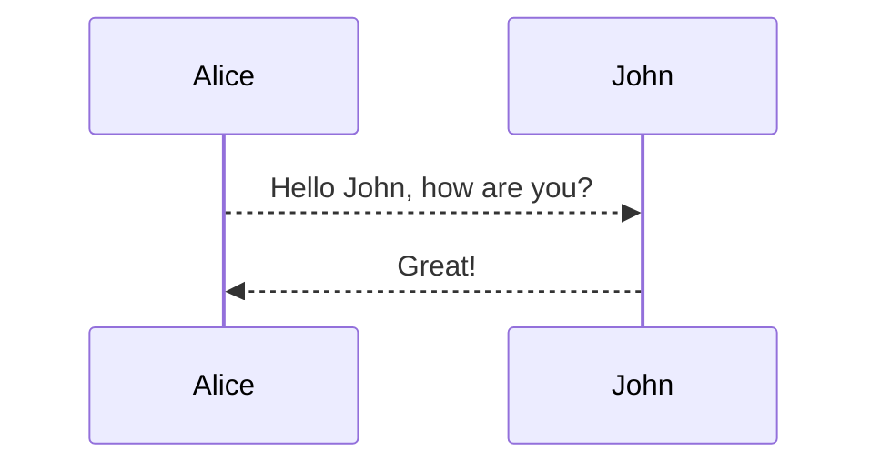

## 目录

Markdown是一种轻量级标记语言，排版语法简洁，让人们更多地关注内容本身而非排版。它使用易读易写的纯文本格式编写文档，可与HTML混编，可导出 HTML、PDF 以及本身的 .md 格式的文件。因简洁、高效、易读、易写，Markdown被大量使用，如Github、Wikipedia、简书等。

在线体验一下 [Markdown在线编辑器](https://markdown.com.cn/editor/)。

千万不要被「标记」、「语言」吓到，Markdown的语法十分简单，常用的标记符号不超过十个，用于日常写作记录绰绰有余，不到半小时就能完全掌握。

就是这十个不到的标记符号，却能让人优雅地沉浸式记录，专注内容而不是纠结排版，达到「心中无尘，码字入神」的境界。

[教程](https://markdown.com.cn/basic-syntax/)

* TOC
{:toc}

## 超链接

```text
[靠谱-ing](https://mazhuang.org)
<https://mazhuang.org>
```

[靠谱-ing](https://mazhuang.org)  
<https://mazhuang.org>

## 列表

```text
1. 有序列表项 1
2. 有序列表项 2
3. 有序列表项 3
```

1. 有序列表项 1
2. 有序列表项 2
3. 有序列表项 3

```text
* 无序列表项 1
* 无序列表项 2
* 无序列表项 3
```

* 无序列表项 1
* 无序列表项 2
* 无序列表项 3

```text
- [x] 任务列表 1
- [ ] 任务列表 2
```

* [x] 任务列表 1
* [ ] 任务列表 2

## 强调

```text
~~删除线~~

**加黑**

*斜体*
```

* ~~删除线~~
* **加黑**
* *斜体*

## 标题

```text
# 一级标题
## 二级标题
## 三级标题
### 四级标题
#### 五级标题
#### 六级标题
```

Tips: `#` 与标题中间要加空格。

## 表格

```text
| HEADER1 | HEADER2 | HEADER3 | HEADER4 |
| ------- | :------ | :-----: | ------: |
| content | content | content | content |
```

| HEADER1 | HEADER2 | HEADER3 | HEADER4 |
| ------- | :------ | :-----: | ------: |
| content | content | content | content |

1. :----- 表示左对齐
2. :----: 表示中对齐
3. -----: 表示右对齐

## 代码块

```python
print 'Hello, World!'
```

1. list item1

2. list item2

   ```python
   print 'hello'
   ```

## 图片

```text

```


## 锚点

```text
* [目录](#目录)
```

* [目录](#目录)

## Inline Attribute

Span Inline Attribute 详情参考 <https://kramdown.gettalong.org/syntax.html#span-ials>

Block Inline Attribute 详情参考 <https://kramdown.gettalong.org/syntax.html#block-ials>

给块/元素添加 class、id、内嵌样式等：

```text
{:.center}

Hello, *world*{:#world} 

Hello, *world*{: style="color:red"} 
```

{:.center}

Hello, *world*{:#world}

Hello, *world*{: style="color:red"}

结合自定义的样式，有些场景比较有用。

## Emoji

:camel:
:blush:
:smile:

## Footnotes

This is a text with footnote[^1].

## mermaid



## sequence

```sequence
Andrew->China: Says Hello
Note right of China: China thinks\nabout it
China-->Andrew: How are you?
Andrew->>China: I am good thanks!
```

## flowchart

```flow
st=>start: Start
e=>end
op1=>operation: My Operation
sub1=>subroutine: My Subroutine
cond=>condition: Yes
or No?
io=>inputoutput: catch something...

st->op1->cond
cond(yes)->io->e
cond(no)->sub1(right)->op1
```

## mathjax

When $$(a \ne 0)$$, there are two solutions to $$(ax^2 + bx + c = 0)$$ and they are

$$x = {-b \pm \sqrt{b^2-4ac} \over 2a}.$$

[^1]: Here is the footnote 1 definition.
