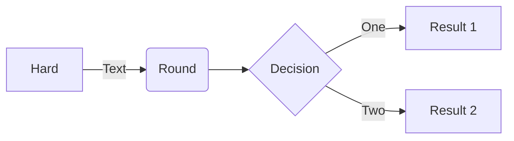
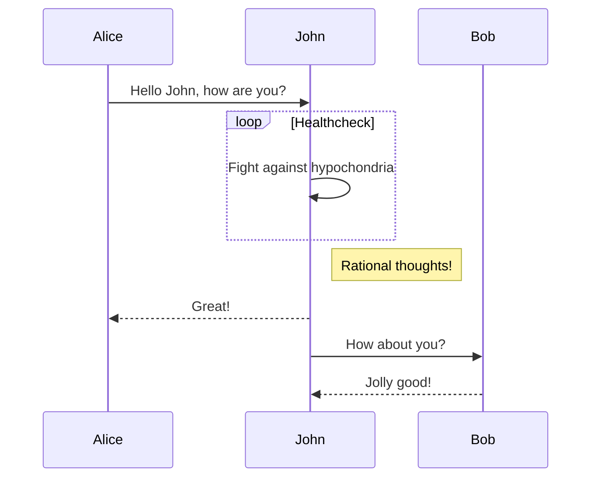
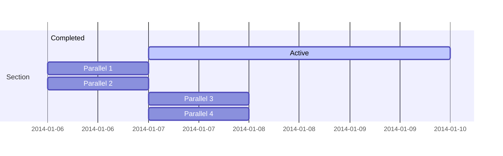
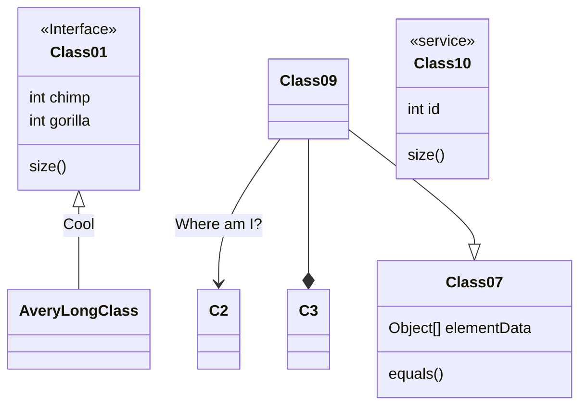
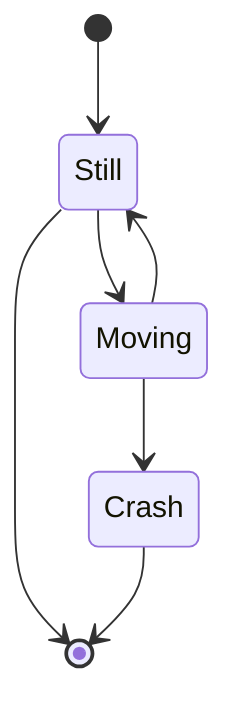
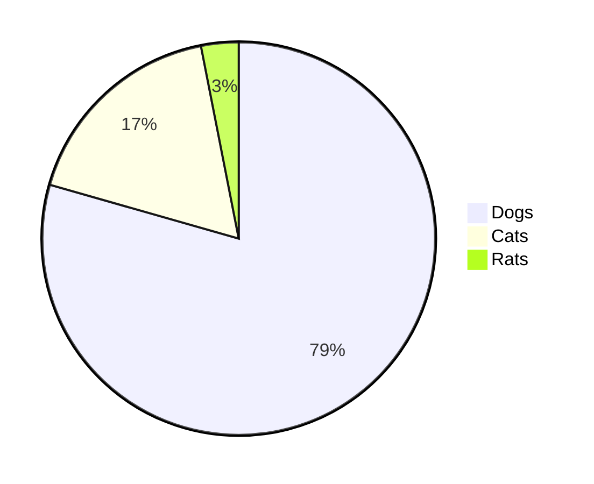
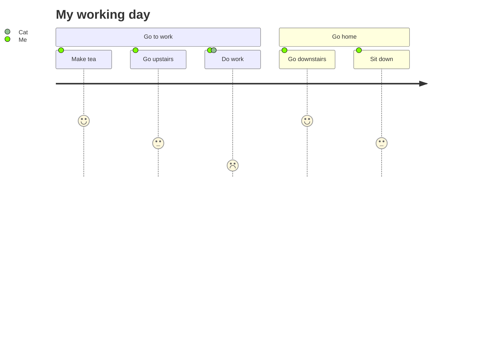

# mermaid

内容来自<https://github.com/mermaid-js/mermaid/blob/develop/README.zh-CN.md>

[](https://travis-ci.org/mermaid-js/mermaid)[](https://www.npmjs.com/package/mermaid)[](https://coveralls.io/github/mermaid-js/mermaid?branch=master)[](https://join.slack.com/t/mermaid-talk/shared_invite/enQtNzc4NDIyNzk4OTAyLWVhYjQxOTI2OTg4YmE1ZmJkY2Y4MTU3ODliYmIwOTY3NDJlYjA0YjIyZTdkMDMyZTUwOGI0NjEzYmEwODcwOTE)

:trophy: **Mermaid 被提名并获得了 [JS Open Source Awards (2019)](https://osawards.com/javascript/2019) 的 "The most exciting use of technology" 奖项!!!**

**感谢所有参与进来提交 PR，解答疑问的人们!**🙏

## 关于 Mermaid

<!-- <Main description>   -->

Mermaid 是一个基于 Javascript 的图表绘制工具，通过解析类 Markdown 的文本语法来实现图表的创建和动态修改。Mermaid 诞生的主要目的是让文档的更新能够及时跟上开发进度。

> Doc-Rot 是 Mermaid 致力于解决的一个难题。

绘图和编写文档花费了开发者宝贵的开发时间，而且随着业务的变更，它很快就会过期。 但是如果缺少了图表或文档，对于生产力和团队新人的业务学习都会产生巨大的阻碍。

Mermaid 通过允许用户创建便于修改的图表来解决这一难题，它也可以作为生产脚本（或其他代码）的一部分。

Mermaid 甚至能让非程序员也能通过 [Mermaid Live Editor](https://mermaid.live/) 轻松创建详细的图表。

你可以访问 [教程](./docs/Tutorials.md) 来查看 Live Editor 的视频教程，也可以查看 [Mermaid 的集成和使用](./docs/integrations.md) 这个清单来检查你的文档工具是否已经集成了 Mermaid 支持。

如果想要查看关于 Mermaid 更详细的介绍及基础使用方式，可以查看 [入门指引](./docs/n00b-overview.md), [用法](./docs/usage.md) 和 [教程](./docs/Tutorials.md).

🌐 [CDN](https://unpkg.com/mermaid/) | 📖 [文档](https://mermaidjs.github.io) | 🙌 [贡献](https://github.com/mermaid-js/mermaid/blob/develop/CONTRIBUTING.md) | 📜 [更新日志](./docs/CHANGELOG.md)

<!-- </Main description> -->

## 示例

**下面是一些可以使用 Mermaid 创建的图表示例。点击 [语法](https://mermaid-js.github.io/mermaid/#/n00b-syntaxReference) 查看详情。**

### 流程图 [[文档](https://mermaid-js.github.io/mermaid/#/flowchart)]

```text
flowchart LR
A[Hard] -->|Text| B(Round)
B --> C{Decision}
C -->|One| D[Result 1]
C -->|Two| E[Result 2]
```



### 时序图 [[文档](https://mermaid-js.github.io/mermaid/#/sequenceDiagram)]

```text
sequenceDiagram
Alice->>John: Hello John, how are you?
loop Healthcheck
    John->>John: Fight against hypochondria
end
Note right of John: Rational thoughts!
John-->>Alice: Great!
John->>Bob: How about you?
Bob-->>John: Jolly good!
```



### 甘特图 [[文档](https://mermaid-js.github.io/mermaid/#/gantt)]

```text
gantt
    section Section
    Completed :done,    des1, 2014-01-06,2014-01-08
    Active        :active,  des2, 2014-01-07, 3d
    Parallel 1   :         des3, after des1, 1d
    Parallel 2   :         des4, after des1, 1d
    Parallel 3   :         des5, after des3, 1d
    Parallel 4   :         des6, after des4, 1d
```



### 类图 [[文档](https://mermaid-js.github.io/mermaid/#/classDiagram)]

```text
classDiagram
Class01 <|-- AveryLongClass : Cool
<<Interface>> Class01
Class09 --> C2 : Where am I?
Class09 --* C3
Class09 --|> Class07
Class07 : equals()
Class07 : Object[] elementData
Class01 : size()
Class01 : int chimp
Class01 : int gorilla
class Class10 {
  <<service>>
  int id
  size()
}
```



### 状态图 [[文档](https://mermaid-js.github.io/mermaid/#/stateDiagram)]

```text
stateDiagram-v2
[*] --> Still
Still --> [*]
Still --> Moving
Moving --> Still
Moving --> Crash
Crash --> [*]
```



### 饼图 [[文档](https://mermaid-js.github.io/mermaid/#/pie)]

```text
pie
"Dogs" : 386
"Cats" : 85
"Rats" : 15
```



### 用户体验旅程图 [[文档](https://mermaid-js.github.io/mermaid/#/user-journey)]

```text
  journey
    title My working day
    section Go to work
      Make tea: 5: Me
      Go upstairs: 3: Me
      Do work: 1: Me, Cat
    section Go home
      Go downstairs: 5: Me
      Sit down: 3: Me
```



## 相关项目

- [Command Line Interface](https://github.com/mermaid-js/mermaid-cli)
- [Live Editor](https://github.com/mermaid-js/mermaid-live-editor)
- [HTTP Server](https://github.com/TomWright/mermaid-server)

## 贡献者 [](https://github.com/mermaid-js/mermaid/issues?q=is%3Aissue+is%3Aopen+label%3A%22Good+first+issue%21%22) [](https://github.com/mermaid-js/mermaid/graphs/contributors) [](https://github.com/mermaid-js/mermaid/graphs/contributors)

Mermaid 是一个不断发展中的社区，并且还在接收新的贡献者。有很多不同的方式可以参与进来，而且我们还在寻找额外的帮助。如果你想知道如何开始贡献，请查看 [这个 issue](https://github.com/mermaid-js/mermaid/issues/866)。

关于如何贡献的详细信息可以在 [贡献指南](CONTRIBUTING.md) 中找到。

## 安全

对于公开网站来说，从互联网上的用户处检索文本、存储供后续在浏览器中展示的内容可能是不安全的，理由是用户的内容可能嵌入一些数据加载完成之后就会运行的恶意脚本，这些对于 Mermaid 来说毫无疑问是一个风险，尤其是 mermaid 图表还包含了许多在 html 中使用的字符，这意味着我们难以使用常规的手段来过滤不安全代码，因为这些常规手段会造成图表损坏。我们仍然在努力对获取到的代码进行安全过滤并不断完善我们的程序，但很难保证没有漏洞。

作为拥有外部用户的网站的额外安全级别，我们很高兴推出一个新的安全级别，其中的图表在沙盒 iframe 中渲染，防止代码中的 javascript 被执行，这是在安全性方面迈出的一大步。

_很不幸的是，鱼与熊掌不可兼得，在这个场景下它意味着在可能的恶意代码被阻止时，也会损失部分交互能力_。

## 报告漏洞

如果想要报告漏洞，请发送邮件到 security@mermaid.live, 并附上问题的描述、复现问题的步骤、受影响的版本，以及解决问题的方案（如果有的话）。

## 鸣谢

来自 Knut Sveidqvist:

> _特别感谢 [d3](https://d3js.org/) 和 [dagre-d3](https://github.com/cpettitt/dagre-d3) 这两个优秀的项目，它们提供了图形布局和绘图工具库! 同样感谢 [js-sequence-diagram](https://bramp.github.io/js-sequence-diagrams) 提供了时序图语法的使用。 感谢 Jessica Peter 提供了甘特图渲染的灵感。感谢 [Tyler Long](https://github.com/tylerlong) 从 2017 年四月开始成为了项目的合作者。_
>
> _感谢越来越多的 [贡献者们](https://github.com/knsv/mermaid/graphs/contributors)，没有你们，就没有这个项目的今天！_

---

_Mermaid 是由 Knut Sveidqvist 创建，它为了更简单的文档编写而生。_
