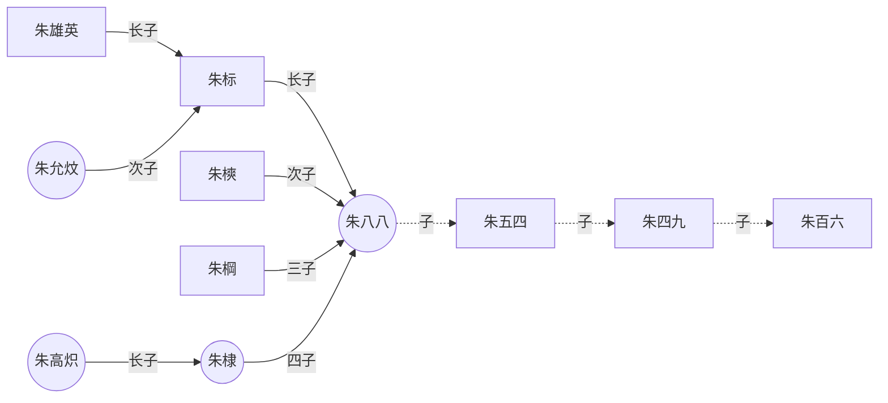

# Mermaid

什么是Mermaid？

* Mermaid是一种基于Javascript的绘图工具，使用类似于Markdown的语法，使用户可以方便快捷地通过代码创建图表。
* 项目地址：<https://github.com/mermaid-js/mermaid>

怎么使用Mermaid？

* VSCode + 插件Markdown Preview Mermaid
* 使用集成了Mermaid渲染功能的Markdown编辑器，如Typora。

Mermaid能绘制哪些图？

* 饼状图：使用pie关键字，具体用法后文将详细介绍
* 流程图：使用graph关键字，具体用法后文将详细介绍
* 序列图：使用sequenceDiagram关键字
* 甘特图：使用gantt关键字
* 类图：使用classDiagram关键字
* 状态图：使用stateDiagram关键字
* 用户旅程图：使用journey关键字

例子

```text
graph LR
emperor((朱八八))-.子.->朱五四-.子.->朱四九-.子.->朱百六

朱雄英--长子-->朱标--长子-->emperor
emperor2((朱允炆))--次子-->朱标
朱樉--次子-->emperor
朱棡--三子-->emperor
emperor3((朱棣))--四子-->emperor
emperor4((朱高炽))--长子-->emperor3
```



更多的例子请查看：<https://zhuanlan.zhihu.com/p/355997933>


<script src="https://cdnjs.cloudflare.com/ajax/libs/mermaid/8.0.0/mermaid.min.js"></script>
<script>
var config = {
    startOnLoad:true,
    theme: 'forest',
    flowchart:{
            useMaxWidth:false,
            htmlLabels:true
        }
};
mermaid.initialize(config);
window.mermaid.init(undefined, document.querySelectorAll('.language-mermaid'));
</script>

