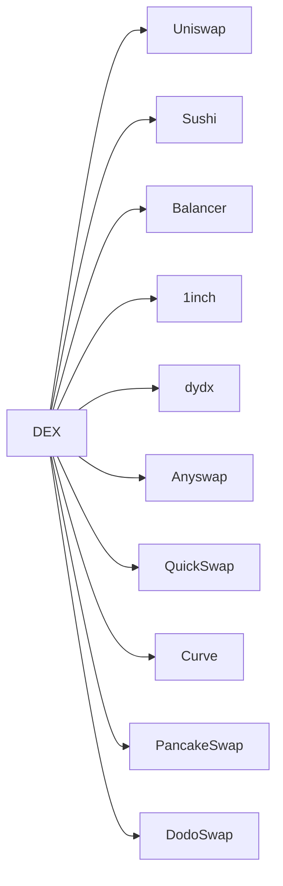

# Uniswap(DEX)

DEX：去中心化交易所(decentralized exchange)，核心逻辑都用区块链实现，用户可以直接调用合约实现交易。

这下面是部分DEX

## 介绍

V1 版本于2018年11月推出，支持 ETH 与其他 Token 交易。

2020年5月，Uniswap v2 引入了新功能和优化，为AMM采用率的指数级增长奠定了基础，支持自定义交易对。

Uniswap v3 版本，2022年5 月 5 日在以太坊主网启动，还计划在 Optimism 上进行 L2 部署。

## 相关链接

* 白皮书：<https://uniswap.org/whitepaper-v3.pdf>
* 博客: <https://uniswap.org/blog/uniswap-v3/>
* 源码：<https://github.com/Uniswap/uniswap-v3-core/>
* SDK: <https://github.com/Uniswap/uniswap-v3-sdk>
* 交易页面：<https://app.uniswap.org/>
* 其他的文章：<https://www.chainnews.com/articles/345963750419.htm>
* Router 合约地址：<https://etherscan.io/txs?a=0xe592427a0aece92de3edee1f18e0157c05861564>
* 代码分析：<https://liaoph.com/uniswap-v3-1/>
* 合约地址：<https://github.com/Uniswap/uniswap-v3-periphery/blob/main/deploys.md>

## 新特性

* 集中流动性（Concentrated liquidity）：对其资本分配的价格范围进行精细控制
* 多种费用等级：流动性提供者可以选择手续费
* 高级预言机

## 集中流动性

### V2的AMM（自动化做市机制）

恒定乘积：X*Y=K

X和Y分别表示交易对的2个token的数量。K就是他们的乘积。

如图所示，假设交易前 DAI 和 ETH 的数量分别是 X 和 Y，交易后是 X'和 Y'。

那么交易遵循 X*Y=k=X'*Y'的规则，k 恒定不变。

*注：这里忽略了手续费的计算，如果算上用户给池子里提供的千三手续费，那么这 2 个币种的乘积是逐渐变大的.*

根据 X*Y=k 这个公式得到上图，横轴是 DAI 的数量（图中的 A token），纵轴是 ETH（图中的 B token）的数量。 曲线的含义是，由于发生了交易，池子里的 DAI 和 ETH 数量会发生变化，所有可能的数量关系共同组成了这条曲线。

v2 中的交易范围是(0, ∞)

交易池中保留的肯定是价值更低的。如果交易池中的价值高，那么用户就会通过交易，获得盈利，从而使交易池中的价值降低。

### V3的流动性

单个流动性：<https://uniswap.org/static/CYL-0c1741eee14f9ced700fe7e88b07f5eb.mp4>

深度：<https://uniswap.org/static/IS-78bf088a79f73ecefb9afc8c094e2234.mp4>

Uniswap V3的交易依旧采用的乘积固定模型 (x*y=k)。
所谓的虚拟资金池 (Virtual Reserves)，是指还在乘积固定曲线上，只提供某个区间流动性的资金池：

图中的墨绿色的曲线就是虚拟资金池满足的乘积固定曲线。事实上需要的资金的曲线如图中的橘黄色。橘黄色的曲线公式如下图：

你可以想象成虚拟资金曲线在 x/y 轴进行平移，使得 a/b 点和 x/y 轴重合。也就是用一定量的资金就能达到「虚拟」的交易曲线的效果。

为此，Uniswap V3 引入了 Tick 的概念。Uniswap V3 将整体价格曲线分解成很多不同的 Tick。 每个 Tick 都有流动性，如果一个 Tick 的流动性耗尽，那么交易会进入下一个 Tick。 流动性提供者在某个价格区间提供流动性时，这些流动性会被分配到这个区间的所有 Tick 中。 价格区间可以由区间上下限的两个 Tick 表示。交易费可以对每一个 Tick 分别进行计算，并根据这个 Tick 上的流动性占比对流动性提供者进行交易费的分配。

详细分析：<https://www.chainnews.com/articles/695762117096.htm>

## Tick

在区间上提供流动性，带来很多复杂的情况：区间和区间的重叠覆盖。

因为不同区间的流动性没有可比性，某个交易费并不能混入到流动资金中，等删除流动性时候一并提取。

为了解决这个问题，Uniswap V3 引入了 Tick 的概念。交易费用实时结算并单独记录，并不混入流动资金中。

虽然整个区间和区间的流动性没有可比性，但是，在具体的某个价格点上（一个价格片上），流动性是可比较的。

Uniswap V3 将整个价格范围 (负无穷到正无穷) 分成一个个的价格点。

$$p(i)=1.0001i$$

后一个价格点的价格是前一个价格点价格基础上浮动万分之一。

## 交易

交易页面:<https://app.uniswap.org/>

## 资本效率

通过集中其流动性，用户可以在指定的价格范围内提供与 v2 相同的流动性深度，同时使更少的资本风险。
节省的资金可以存放在外部，投资于其他资产，存放在 DeFi 的其他位置，或用于在指定价格范围内增加敞口，以赚取更多交易费。

Alice 和 Bob 都希望在 Uniswap v3 的 ETH / DAI 池中提供流动性。
他们每个人都有 100 万美元。ETH 当前价格为 1,500 DAI。

Alice 决定在整个价格范围内部署资金（就像在 Uniswap v2 中一样）。她存入 500,000 DAI 和 333.33 ETH（总价值 100 万美元）。

相反，Bob 创建了一个集中流动性的仓位，仅在 1,000 至 2,250 的价格范围内存款。
他存入 91,751 DAI 和 61.17 ETH，总价值约 183,500 美元。 他自己保留其余的$ 816,500，但可以根据自己的意愿进行投资。

尽管 Alice 投入的资金是 Bob 的 5.44 倍，但只要 ETH/DAI 的价格保持在 1,000 至 2,250 范围之内，他们就能赚取相同数量的费用。

集中流动性也是一种避险策略。如果 ETH 的价格跌到 0，则 Alice 将损失所有，而 Bob 则损失$183,000。

v3 LP 可以选择以更大的深度提供与 v2 对应者相同的资本，而不是像 v2 LP 那样以较少的资本提供等效的流动性深度。
这需要承担更多的价格风险（无偿损失），同时支持更多的交易并赚取更高的费用

如果都将所有资金都投入的情况，V2版本价格跌到0，则损失所有；而V3版本中，价格跌出区间，就会损失50%，区间越小，损失越大，但可能得收益也越大。

## 高级预言机

Uniswap v2 引入了时间加权平均价格（TWAP）。这些预言机是 DeFi 基础架构的关键部分，并已集成到数十个项目中，包括 Compound 和 Reflexer。

V2 预言机通过存储 Uniswap 对（价格*时间）的累积总和来工作。
可以在一个周期开始时检查一次这些价格总和，在结束时检查一次，以计算该时间段内的准确 TWAP。
V2 版本的预言机使用门槛比较高，官方合约中只提供了最新的价格累积值，开发者需要自己实现历史价格的记录和抓取 在使用 DEX 预言机时，深度是一个比较重要的考量指标，深度决定了此交易对预言机被攻击的难易程度，但是在 v2 版本我们无法通过简单的方式获取交易对深度变化的历史数据。

Uniswap v3 对 TWAP oracle 进行了重大改进，从而可以在单次链上调用中计算过去 9 天内的任何最新 TWAP。
这是通过存储一组累积和来实现的。

这一系列的历史价格累加器使创建更高级的预言机变得更加容易和便宜，这些预言包括简单移动平均线（SMA），指数移动平均线（EMA），离群值过滤等等。
尽管有了这一重大改进，但与 Universe Server 交易商保持 Oracle 实时更新有关的 Gas 成本相对于 v2 降低了约 50％。同样，在外部智能合约中计算 TWAP 的成本也要便宜得多。
*注：用户交易的手续费增加了*

这种预言机并不是完美的，反而有比较严重的问题：

1. 如果仓位的范围很小（如稳定币的交易对），非常容易被单侧清空
2. 只要在超低价格有一个流动性，价格就简单的被击穿
3. 预言机的价格就会与预期差异非常大
4. 如果基于这个价格进行借贷，则会出现超额借贷的情况
5. 已经发生过类似的攻击事件

更多详解：<https://liaoph.com/uniswap-v3-5/>

## 费用

### 项目手续费

Uniswap v3 为 LP 向每对 LP 提供三个单独的费用等级 0.05%，0.30%和 1.00%。

V2 版本的手续费固定为0.30%，是直接放进 LP 的，相当于复利的效果。

V3 版本的手续费是单独计算的，退出流动性的时候计算收益（逐个 tick 计算）。

### ETH 的 GAS 费

Gas 的消耗根据用户自己的地址、代币的种类以及很多因素相关，所以仅供参考。

提供流动性（参考多个交易对）：

* V2：16 万 Gas
* V3：40 万 Gas（相比 V2 增加了 150%，与 tick 数量有关系）

交易 / 兑换（参考了 USDC/ETH 单路由交易对）：

* V2：13 万 Gas
* V3：14 万 Gas（单个 tick 的差别较小，但整个交易与tick数量关系较大）

## 闪电贷

Uniswap v2 版本中，提供了被称作 flash swap 的闪电贷功能。即可以向一个交易对借贷 x token，但在还贷时使用 y token.

一个普通的 Uniswap v2 交易的执行顺序为：

1. 交易之前，Uniswap Pair 合约中 x, y token 余额满足 x⋅y=k
1. 用户支付 x token 到合约中
1. 调用合约的交易接口
1. 合约计算出用户可以得到的 y token，并发送给用户
1. 交易完成后，Uniswap Pair 合约中 x, y token 余额满足 x′⋅y′≥k
Uniswap v3 版本中，交易池由多个不同的流动性池组成，因此不能使用一个简单的 x⋅y=k 算式来描述 v3 版本的 AMM。 这样一来，v2 版本中实现的 flashswap 在 v3 中会很难以实现。因此 v3 版本的 Uniswap 只提供了普通的闪电贷功能。 实现过程如下：
1. 使用 flash() 借贷 token x
1. 在回调函数中，执行套利逻辑，获得 token y
1. 在回调函数中，调用 swap() 接口将获得的 token y 换回成 token x
1. 归还借贷的 token x

## 无偿损失

简单来说，无常损失/非永久性损失是指在用同样的价值为 AMM 提供流动性和简单持有之间的由于市场币价波动产生的价格差。
之所以叫做非永久性损失，是因为只要在 AMM 中的代币相对价格恢复到其初始状态，那么，该损失就消失了。
但是，这种情况很少发生。通常，无常损失会变成永久性损失，吞掉你的交易费用收入甚至导致负回报。

当 AMM 中的代币市场价格在涨或跌时，就会产生无常损失。波动越大，无常损失越大。

## 影响

* 手续费：Uniswap 的 Gas 消耗一直都是 DEX 中最低的之一，但是此次聚合流动性功能的上线，可能会增加整体的复杂度并增加 Gas 消耗，如果上线 Optimism 的 Layer 2 就能解决这样的问题。
* 非同质化：LP Token 变为非同质化代币，也就是仓位即 NFT
* 如何聚合 Layer1 和 Layer2 的流动性
* 流动性终结？当 LP 很少，价格波动超过 LP 的范围，将直接导致流动性终结
* 基于它的预言机，需要考虑价格击穿的场景
* 对三明治套利的影响
* V3 中是否有 UNI 的奖励？
* token 数量如果会动态变化，不适合用Uniswap V3，如 AMPL 这种通过 rebase 改变所有账户钱包余额的方式
* 部分项目方直接将奖励发送给 LP 的方式不能支持了
