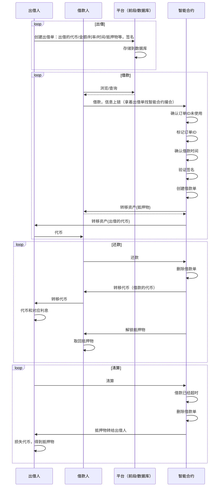

# 基于订单簿的借贷系统

1. 这只是一个想法
2. 支持借贷，就能够对任意代币进行做多/做空，是很基础的金融手段。

## 场景

1. 在中心化交易所里，支持杠杆交易，可以做多/做空各种代币。
   1. 在DeFi中，只有主流的代币支持做多/做空
   2. euler虽然支持任意代币，但长尾资产的交易深度不够，非常容易被恶意操控价格
2. 市场上还没有其他的协议能够支持任意代币的借贷。

## 目标

1. 不限制代币，没有白名单；支持任意数字代币的借贷（新代币、长尾代币）
2. 没有价格波动的清算，只有到期清算
3. 利息固定，借款双方更方便计算收益

## 流程

1. 出借人：借出token的人，可以获得利息收益
   1. 只需要链下签名，一般情况下，无需直接与合约交互，挂单无需手续费
2. 借款人：想要借token的人，需要抵押指定的资产，到期需要还款并支付利息

## 角色

### 出借人

1. 可以自己指定要借出的token
2. 需要approve给撮合合约
3. 同一份资产，允许多次挂单，不同的数量、利息、到期事件等
4. 出借人只需要挂单并签名，挂单是放到平台的数据库里的
5. 默认出借人不需要支付任何手续费。
6. Token参数：
   1. id
   2. 代币类型：合约地址
   3. 数量
   4. 利息代币类型：序号
      1. 借出的代币
      2. 抵押的代币
      3. eth
      4. dai
      5. usdt
   5. 年利息：数量
   6. 时间：最短时间，最长时间
   7. 抵押物资产类型和数量
      1. 默认是WETH
      2. 可以指定其他类型代币
      3. 可以是NFT
   8. 限定借款人：地址为空表示不限制
   9. 预言机：为空表示不需要
7. NFT参数：
   1. id
   2. NFT类型
   3. 利息代币类型：序号
      1. 抵押的代币
      2. eth
      3. dai
      4. usdt
   4. 年利息：数量
   5. 时间：最短时间，最长时间
   6. 抵押物资产类型和数量
   7. 限定借款人
8. 出借人可以是合约
   1. 合约实现特定的接口，用于校验挂单的合法性（代替签名校验）
   2. 返回订单id

### 借款人

1. 从平台上，选择想要借的资产，数量
2. 参数：
   1. id
   2. 选择要借贷的时间
      1. 大于最小时间
      2. 小于最大时间
      3. 小于1年
   3. 要使用的存储空间id
      1. 空间复用，节省成本
3. 将出借人的挂单和自己选项提交上链，通过合约完成撮合

### 智能合约

1. 撮合双方的交易
2. 代持抵押物
3. 记录挂单完成状态
4. 偿还流程处理
5. 超时清算处理
6. 一键卖出（做空）

### 平台（链下部分）

1. 展示：显示所有的挂单
2. 查询：可以根据需要，选择/过滤自己需要的挂单
3. 存储服务：存储用户提交的挂单

## 模式

1. maker
   1. 由出借人挂单，借款人上链
2. taker
   1. 由借款人提出需求，出借人同意并上链

## 扩展

### 资金池

1. 用智能合约（子合约）实现一个资金池，合约作为出借方
2. 资金池作为一个出借账号，它可以基于预言机
3. 用户只需要将资金放入借贷池，所有人平分收益
4. 借款人通过借贷池创建一个虚拟挂单
5. 由于是固定利息，所以利息会偏高，允许出借用户主动承接借条（降低利息）
   1. 出借方为借款人偿还掉资金
   2. 出借方享受后续的利息
   3. 出借方承担借款人违约的风险
   4. 出借方要的利息必须低于合约的利息
6. 借款人到期赎回时，按默认的利息支付
   1. 如果没有人承接借条，利息归智能合约
   2. 如果有人承接借条，根据新的利息，返还多余的利息，其他的本金和利息转给出借人
      1. 实际出借人提供了更低的利息的资金，所以多的利息需要返还给借款人
7. 遗留问题：
   1. 如何吸引用户将资金放到池子里？
   2. 如何解决多个出借方对同一笔借款的承接问题？
      1. 用户将资产放入池子
      2. A借100U，时间3个天，利息为10%，借条上出借人为池子
      3. 第二天，B愿意8%的利息出借，（100U+1天的10%利息）还给池子，借条的出借人改为B
      4. 3天到期，A需要偿还的利息为1天的10%+2天的8%
      5. 池子收到的利息为1天的10%
      6. B收到的利息为2天的8%
   3. 资金池不足，资金提供者如何取回资产；提供更多资金，如何计算份额
      1. 计算当前贷出去的资金和应收利息是多少
      2. 根据资金可占用份额，给与对应的cToken

## 可能存在的问题

1. EthLend本身就是基于P2P的方式
   1. 流动性不足，撮合有难度
2. 用户抵押的资产没有利用起来，资金利用率低
   1. 将其放到Compound/Aave产生收益
3. 需要和其他DEX组合，方便一键借贷后与DEX实现买卖，从而实现杠杆交易
