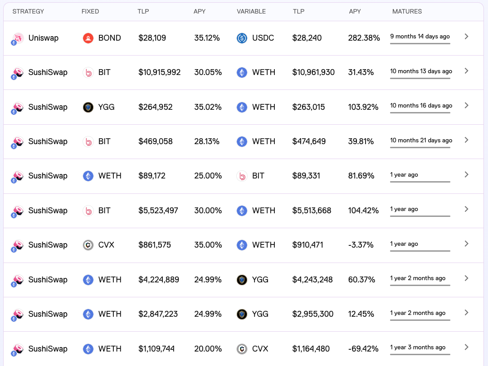

# Ondo Finance

1. [官网](https://ondo.finance/)
2. [文档](https://docs.ondo.finance/)
3. V1版本是2022年上线的，聚合用户的资产，组成LP放到DEX里赚收益。
4. 新版本则是筹集用户的代币，购买国债/基金等现实中的金融产品。

## V1 说明

提供建立在去中心化交易所之上的结构性产品，允许用户发起由加密支持的贷款以赚取收益。

这些产品被称为“金库”，初始金库中有两种类型的头寸：固定收益和可变收益。固定收益金库中的存款人获得其初始投资的收益率的固定百分比，可变收益金库中的存款人在固定收益金库收到其支出后获得所有超额回报（也可能亏损）。贷款人和借款人共同在“Ondo Vaults”中投入资金，使用智能合约来执行贷款条款。

每个金库对应2个币，分主次，一个币为固定收益，另一个币则是可变收益。

可变收益是不保证收益的，交易对的无偿损失是由可变收益投资者承担的。如下图的CVX和WETH交易对，可变收益都是损失。

单纯的DEX交易对的收益，收益率可能不是很高，对应的固定收益也没法设置很高，可变收益的代币投资很容易出现亏损。如果没有与代币项目方合作，收益难以保证，非常容易导致投资者的损失（很多代币项目方为了鼓励流动性提供者，会额外给予代币奖励）。对用户来说不友好，吸引力不足。

这个版本项目方已经正式通知下线了。

### 合约

[etherscan上的合约源码](https://etherscan.io/address/0x2bb8de958134afd7543d4063cafad0b7c6de08bc#code)

入口合约：AllPairVault.sol

主要流程：

1. createVault：创建一个新的“金库”
   1. 包含交易对的信息（分主次）、投资时间、固定收益利息、投资策略（在哪个DEX添加流动性）等。
   2. 每个vault都有对应的id，比如0x437f27a80e4b66557a94b1705d408b229f2c91ce94f5f3a74a0697371101bddb
2. deposit：投资者将代币授权给合约后，调用这个接口，向指定的vault投资。
3. invest：管理员将vault里面的代币组成LP添加到DEX里面。
4. redeem：到期后，管理员将代币从DEX撤回，并计算收益情况。
5. withdraw：用户就可以调用withdraw，取回资产和对应收益了。

其他场景：

1. 大部分的DEX的交易对，价格固定的情况下，两个币的所需数量比例是固定的。
   1. ondo上可能出现用户deposit的数量和所需数量不一致的情况
   2. 这时允许用户调用claim撤回多余的代币。
2. 不同的DEX，可能接口不一样
   1. 项目方将这些逻辑抽象为strategy
   2. 不同的strategy可以对接不同的DEX，也可以对接其他的farming项目
   3. 还能够避免项目太大导致合约超过24K的限制
3. 收益计算：
   1. 优先保障固定收益的资产
   2. 剩下的资产属于可变收益的
   3. 如果实际收益无法覆盖固定收益，则可变收益对应的本金会被拿来填补固定收益；此时可变收益的投资将产生亏损。
