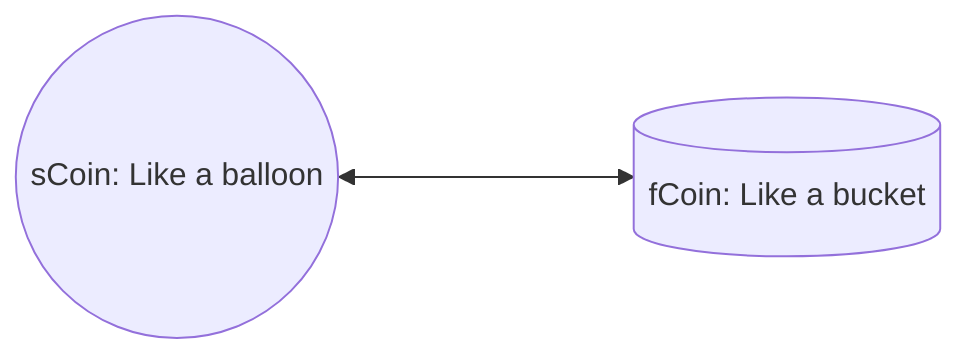

# 算法稳定币

这只是一个想法，关于算法稳定币的。
稳定币是避险资产，DAI会由于ETH的贬值，总量缩小，且在贬值阶段，普通用户不敢质押ETH铸造更多的DAI，难以真正达到避险的功能。

## 算法稳定币的定义

1. 系统包含2个币
   1. 一个是标准的ERC20，类似DAI，fixed coin，简称fCoin
   2. 一个是可以rebase的，类似AMPL，scalable coin，简称sCoin
   3. 两个币可以自由兑换（mint/burn）
2. sCoin
   1. 每天定时rebase，根据fCoin的币价来决定rebase的比例，调整全局系数，从而影响所有sCoin的持有者
   2. 如果币价高于1U，则调低系数，所有sCoin的持有者的sCoin将减少
   3. 如果币价低于1U，则调高系数，所有sCoin的持有者的sCoin将增加
3. fCoin
   1. 标准的ERC20，可以作为常用的稳定币

## 算法稳定币的实现

1. 任何人都可以用ETH，借贷sCoin
   1. 用预言机价格，抵押率为150%，可以算出能够借贷的sCoin数量
   2. 用户的ETH不会因为ETH价格变化导致清算
   3. 有借贷期限：7天，1个月，6个月
      1. 不同期限不同费用，费用是以eth数量计算的
      2. 0.5%、1%、5%
      3. 费用以eth支付
   4. 如果到期还不还款，将被清算
2. 任何人都可以用sCoin兑换成fCoin
   1. 兑换比例为1:1
   2. 兑换手续费：0.1%
   3. 兑换后，sCoin将减少(burn)
   4. 兑换后，fCoin将增加(mint)
3. 任何人都可以用fCoin兑换成sCoin
   1. 兑换比例为1:1
   2. 兑换手续费：0.1%
   3. 兑换后，fCoin将减少(burn)
   4. 兑换后，sCoin将增加(mint)
4. rebase
   1. 每天定时rebase，根据sCoin的币价来决定rebase的比例，调整sCoin的全局系数，从而影响所有sCoin的持有者
   2. 如果币价高于1U，则调低系数，所有sCoin的持有者的sCoin将减少
   3. 如果币价低于1U，则调高系数，所有sCoin的持有者的sCoin将增加
5. 预言机
   1. 可以从预言机（chainlink）获取ETH/USD的真实价格
   2. 从交易对获取ETH/sCoin的TWAP价格
   3. 用两个价格就可以算出sCoin的价格
   4. 通过sCoin的价格，就可以调整sCoin的全局系数
6. 清算
   1. 如果用户到期都没有还款，将被清算
   2. 清算时，根据当前币价，将ETH-sCoin添加到交易对中，增加池子的流动性

### 改进

1. 如果仅仅以sCoin的价格进行rebase，很容易导致整体价格波动过大，且总量变化太快。
2. 将根据sCoin的价格和交易对中sCoin数量对于总量占比，综合计算需要调整的系数。
3. 同时将给mint部分sCoin添加到交易对中，以增加交易对流动性。
4. 比如sCoin=1.5U，需要调整的系数为增大0.5，其中0.2通过mint sCoin放到流动池，0.3为调整的系数

## 场景分析

### 初始场景

1. 项目方提供部分eth，初始mint对应的sCoin，组成LP放到交易池中

### mint sCoin场景(deposit)

1. 用户用eth借sCoin，选择到期时间
2. 系统中有一条记录
   1. 记录ID
   2. 用户地址
   3. 借出的sCoin数量
   4. 到期时间
   5. 到期时可以赎回的eth数量（扣除手续费）

### burn sCoin场景(withdraw)

1. 选择记录ID
2. 查询该记录的详情
3. 确认用户和记录匹配
4. burn用户的sCoin
5. 删除记录
6. 将eth转给用户

### sCoin兑换fCoin

1. 用户选择要兑换的sCoin数量
2. burn用户对应的sCoin
3. 给用户mint对应的fCoin（会扣除0.1%的手续费）

### fCoin兑换sCoin

1. 用户选择要兑换的fCoin数量
2. burn用户对应的fCoin
3. 给用户mint对应的sCoin（会扣除0.1%的手续费）

### 清算

1. 清算人提交要清算的记录ID
2. 确认记录已经过期
3. 清除记录
4. 从预言机获取eth的价格
5. mint对应数量的sCoin
6. 将eth-sCoin添加到交易对中，增加池子的流动性

### sCoin > 1U

1. 从预言机获取eth的价格，为3000U
2. 从交易池中获取eth的TWAP，为2000sCoin
3. 则sCoin价格为3000U/2000sCoin = 1.5U
4. 如果交易池中sCoin有10000个，则目标为15000个
5. mint2000个sCoin，并添加到交易池中（40%增幅通过mint sCoin实现）
6. 现在需要调整的系数则为15000/(10000+2000)=1.25
7. 由于1.25大于1.05，则调整系统设置为1.05(5%是系统默认允许单次可向上调整的最大比例)
8. 全局系数base=base*1.05

### sCoin < 1U

1. 从预言机获取eth的价格，为3000U
2. 从交易池中获取eth的TWAP，为5000sCoin
3. 则sCoin价格为3000U/5000sCoin = 0.6U
4. 如果交易池中sCoin有10000个，则目标为6000个
5. 需要调整的系数为0.6
6. 由于0.6小于0.9，则调整系统设置为0.9(10%是系统默认允许单次可向下调整的最大比例)
7. 全局系数base=base*0.9
8. 在sCoin价格很低的时候，可以兑换成fCoin，从而避免被rebase
9. 这种情况下，会导致fCoin的价格也一起降低。
10. 不过等到第二天，sCoin因为rebase，价格回升，fCoin也会回升。
11. 如果sCoin+fCoin的总量远远高于eth的价值，可能需要经过较长时间的rebase，才能够真正将sCoin+fCoin的总量降低到eth的价值。

## 算法稳定币的收益

1. 用户质押ETH铸造sCoin，到期需要偿还sCoin和对应利息。利息就是整个系统的收益之一。
2. 交易对的手续费，是系统的另一部分收益。

## 算法稳定币的缺点

1. 因为可以rebase，所以sCoin+fCoin的数量将可能远远大于质押的ETH价值
2. 价格容易波动，需要尽量增大交易对的流动性，从而保证价格的稳定

## 算法稳定币的展望

1. 拥有足够的体量，从而可以在整个web3领域占有一定的地位
2. 更多的项目使用fCoin
