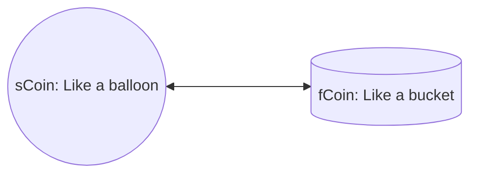

# 算法稳定币

这只是一个想法，关于算法稳定币的。
稳定币是避险资产，DAI会由于ETH的贬值，总量缩小，且在贬值阶段，普通用户不敢质押ETH铸造更多的DAI，难以真正达到避险的功能。

## 算法稳定币的定义

1. 系统包含2个币
   1. 一个是标准的ERC20，类似DAI，fixed coin，简称fCoin
   2. 一个是可以rebase的，类似AMPL，scalable coin，简称sCoin
   3. 两个币可以自由兑换（mint/burn）
2. sCoin
   1. 每天定时rebase，根据fCoin的币价来决定rebase的比例，调整全局系数，从而影响所有sCoin的持有者
   2. 如果币价高于1U，则调低系数，所有sCoin的持有者的sCoin将减少
   3. 如果币价低于1U，则调高系数，所有sCoin的持有者的sCoin将增加
3. fCoin
   1. 标准的ERC20，可以作为常用的稳定币

## 算法稳定币的实现

1. 任何人都可以用ETH，借贷sCoin
   1. 用预言机价格，抵押率为150%，可以算出能够借贷的sCoin数量
   2. 用户的ETH不会因为ETH价格变化导致清算
   3. 有借贷期限：7天，1个月，6个月
      1. 不同期限不同费用
      2. 0.5%、1%、5%
   4. 如果到期还不还款，将被清算
2. 任何人都可以用sCoin兑换成fCoin
   1. 兑换比例为1:1
   2. 兑换手续费：0.1%
   3. 兑换后，sCoin将减少(burn)
   4. 兑换后，fCoin将增加(mint)
3. 任何人都可以用fCoin兑换成sCoin
   1. 兑换比例为1:1
   2. 兑换手续费：0.1%
   3. 兑换后，fCoin将减少(burn)
   4. 兑换后，sCoin将增加(mint)
4. rebase
   1. 每天定时rebase，根据fCoin的币价来决定rebase的比例，调整sCoin的全局系数，从而影响所有sCoin的持有者
   2. 如果币价高于1U，则调低系数，所有sCoin的持有者的sCoin将减少
   3. 如果币价低于1U，则调高系数，所有sCoin的持有者的sCoin将增加
   4. 如果价格没有变化，默认系数-0.01%
5. 预言机
   1. 可以从预言机（chainlink）获取ETH/USD的真实价格
   2. 从交易对获取ETH/fCoin的TWAP价格
   3. 用两个价格就可以算出fCoin的价格
   4. 通过fCoin的价格，就可以调整sCoin的全局系数

### 改进

1. 如果仅仅以fCoin的价格进行rebase，很容易导致整体价格波动过大，且总量变化太快。
2. 将根据fCoin的价格和交易对中fCoin数量、sCoin的数量，综合计算需要调整的系数。
3. 同时将给mint部分fCoin添加到交易对中，以增加交易对流动性。
4. mint部分sCoin到质押池中
   1. 比如fCoin=1.5U，需要调整的系数为增大0.5，其中0.2通过mint fCoin代替，另外0.1mint sCoin，0.2为调整的系数

## 算法稳定币的收益

1. 用户质押ETH铸造sCoin，到期需要偿还sCoin和对应利息。利息就是整个系统的收益之一。
2. 交易对的手续费，是系统的另一部分收益。

## 算法稳定币的缺点

1. 因为可以rebase，所以sCoin+fCoin的数量将可能远远大于质押的ETH价值
2. 价格容易波动，需要尽量增大交易对的流动性，从而保证价格的稳定

## 算法稳定币的展望

1. 拥有足够的体量，从而可以在整个web3领域占有一定的地位
