# n8n自动化平台深度研究报告

## 摘要

n8n是一个开源的工作流自动化平台，允许用户通过可视化界面连接不同的服务和API，实现业务流程的自动化。本报告基于实际使用经验，深入分析了n8n在AI驱动的自动化场景中的应用，特别是与OpenAI结合进行财务数据分析的实践案例。

这个文档是cursor帮忙完成的

## 1. n8n平台概述

### 1.1 技术架构

n8n采用Node.js技术栈构建，具有以下特点：
- **开源免费**：基于Apache 2.0许可证
- **自托管支持**：可部署在自己的服务器上
- **云服务**：提供托管版本，15天免费试用期
- **可视化编程**：基于节点的流程设计界面

### 1.2 定价模型

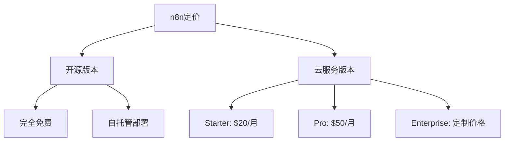

### 1.3 核心功能

- **600+集成**：支持主流SaaS服务和API
- **条件逻辑**：支持分支、循环等复杂流程控制
- **数据转换**：内置JavaScript代码执行环境
- **错误处理**：完善的异常处理机制
- **调度功能**：支持定时任务和Webhook触发

## 2. AI集成能力分析

### 2.1 OpenAI集成

n8n提供原生的OpenAI节点，支持：
- **GPT模型调用**：GPT-3.5、GPT-4等
- **嵌入向量生成**：文本向量化处理
- **函数调用**：Function Calling功能
- **流式响应**：支持实时数据流处理

### 2.2 向量数据库集成

与Supabase等向量数据库的集成提供：
- **向量存储**：文档嵌入和检索
- **相似性搜索**：基于语义的内容查找
- **RAG实现**：检索增强生成架构

### 2.3 AI Agent构建

n8n的AI Agent功能包括：
- **工具调用**：集成外部API和服务
- **上下文管理**：维持对话状态
- **提示工程**：自定义AI行为模式

## 3. 实践案例：财务数据分析自动化

### 3.1 业务需求

目标是构建一个自动化系统，能够：
1. 获取美国上市公司财报电话会议逐字稿
2. 将文档分段并存储到向量数据库
3. 基于用户查询生成结构化分析报告

### 3.2 技术实现流程

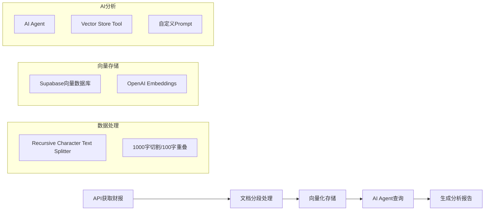

### 3.3 关键技术配置

#### 3.3.1 文档分段策略
- **分割长度**：1000字符
- **重叠长度**：100字符
- **分割器**：Recursive Character Text Splitter

#### 3.3.2 向量数据库设置
```sql
-- Supabase向量表创建SQL（示例）
CREATE TABLE documents (
  id bigserial PRIMARY KEY,
  content text,
  metadata jsonb,
  embedding vector(1536)
);
```

#### 3.3.3 AI Agent提示设计
```
你现在是一位资深财务分析师，擅长基本面分析和市场趋势分析。
你的任务是分析财报数据，需要包含以下部分：
* 本季与上季的重点比较
* 本季财报的增长亮点  
* 本季财报的市场趋势
* 本季财报的潜在隐忧
* 分析师关注的5个重点与回应
```

## 4. 挑战与限制分析

### 4.1 技术挑战

#### 4.1.1 数据处理精度
- **文档分割问题**：可能破坏语义连贯性
- **向量检索精度**：依赖于嵌入模型质量
- **上下文丢失**：长文档处理中的信息损失

#### 4.1.2 集成复杂性
- **API配置**：需要多个服务的认证和配置
- **数据格式**：不同服务间的数据格式转换
- **错误处理**：复杂流程中的异常处理

### 4.2 成本考量

#### 4.2.1 服务费用
- **n8n云服务**：$20-50/月
- **OpenAI API**：按使用量计费
- **Supabase**：免费额度有限
- **总体成本**：中小企业需权衡性价比

#### 4.2.2 开发成本
- **学习曲线**：需要理解多个服务的配置
- **调试时间**：流程复杂时问题定位困难
- **维护成本**：API变更导致的维护工作

## 5. 最佳实践建议

### 5.1 架构设计

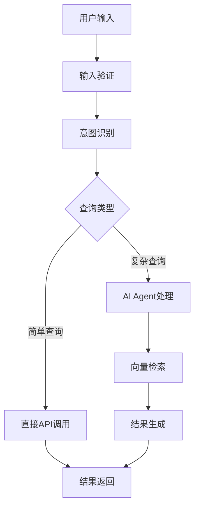

### 5.2 优化策略

#### 5.2.1 数据处理优化
1. **智能分段**：基于语义边界进行文档分割
2. **元数据增强**：为每个片段添加结构化元数据
3. **质量控制**：实施数据质量检查机制

#### 5.2.2 性能优化
1. **缓存策略**：缓存常用查询结果
2. **批处理**：批量处理向量化操作
3. **异步处理**：使用队列处理长时间任务

#### 5.2.3 成本控制
1. **模型选择**：根据任务复杂度选择合适模型
2. **请求优化**：减少不必要的API调用
3. **自托管考虑**：评估自托管vs云服务成本

## 6. 竞品对比分析

### 6.1 主要竞争对手

| 平台 | 优势 | 劣势 | 适用场景 |
|------|------|------|----------|
| **Zapier** | 易用性强、集成丰富 | 定制化限制、成本高 | 简单自动化任务 |
| **Microsoft Power Automate** | 企业级功能、Office集成 | 学习曲线陡峭 | 企业内部流程 |
| **Integromat/Make** | 可视化强、功能全面 | 复杂度高 | 复杂业务流程 |
| **n8n** | 开源灵活、AI友好 | 社区相对小 | 开发者友好场景 |

### 6.2 n8n的差异化优势

1. **开源生态**：完全控制和定制能力
2. **AI原生支持**：深度集成AI服务
3. **开发者友好**：支持自定义节点开发
4. **成本效益**：自托管选项降低长期成本

## 7. 未来发展趋势

### 7.1 技术演进方向

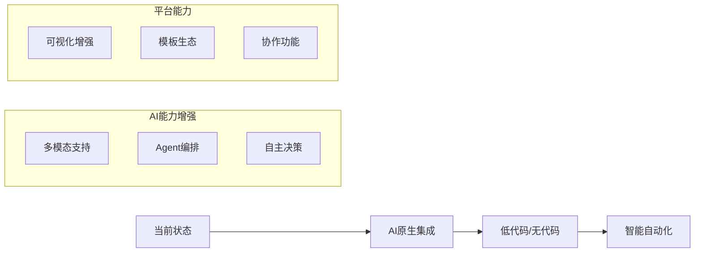

### 7.2 市场机会

1. **企业数字化转型**：中小企业自动化需求增长
2. **AI普及化**：降低AI应用门槛
3. **行业垂直化**：特定行业解决方案
4. **生态建设**：第三方开发者社区

## 8. 结论与建议

### 8.1 核心发现

1. **技术可行性**：n8n在AI自动化场景中表现良好
2. **学习成本**：需要一定的技术背景和时间投入
3. **实际效果**：简单场景效果显著，复杂场景需要优化
4. **成本效益**：对于技术团队具有较好的性价比

### 8.2 应用建议

#### 8.2.1 适合使用n8n的场景
- 有技术团队支持的中小企业
- 需要高度定制化的自动化流程
- 希望控制数据和成本的组织
- AI驱动的业务流程自动化

#### 8.2.2 不适合的场景
- 纯业务用户无技术支持
- 需要企业级治理和合规的大型企业
- 简单的标准化流程自动化
- 对可靠性要求极高的关键业务

### 8.3 实施路径建议

1. **概念验证阶段**：
   - 选择简单场景进行试点
   - 评估团队技术能力
   - 测试集成的服务稳定性

2. **小规模部署**：
   - 构建核心业务流程
   - 建立监控和错误处理机制
   - 收集用户反馈

3. **规模化扩展**：
   - 标准化流程模板
   - 建立最佳实践文档
   - 培训更多团队成员

### 8.4 风险提示

1. **技术风险**：第三方服务依赖和API变更风险
2. **成本风险**：使用量增长导致的成本上升
3. **维护风险**：需要持续的技术投入和维护
4. **数据安全**：多服务集成带来的数据安全考虑

## 参考资料

1. [n8n官方文档](https://docs.n8n.io/)
2. [Supabase AI文档](https://supabase.com/docs/guides/ai)
3. [OpenAI API文档](https://platform.openai.com/docs)
4. [自動化 AI 真的那麼神奇？從 0 開始的 n8n + OpenAI 實戰](https://medium.com/@turkey039)

## 9. 配置文件结构与示例

### 9.1 配置文件格式说明

n8n使用JSON格式保存工作流配置，主要包含以下核心结构：

```json
{
  "name": "工作流名称",
  "nodes": [],           // 节点列表
  "connections": {},     // 节点连接关系
  "settings": {},        // 执行设置
  "meta": {},           // 元数据信息
  "staticData": null,   // 静态数据
  "pinData": {}         // 固定数据
}
```

根据[n8n配置文档](https://docs.n8n.io/hosting/configuration/configuration-examples/)，每个节点包含：
- **id**: 唯一标识符
- **name**: 节点名称
- **type**: 节点类型（如`n8n-nodes-base.if`）
- **parameters**: 节点配置参数
- **position**: UI中的位置坐标

### 9.2 分支处理配置示例

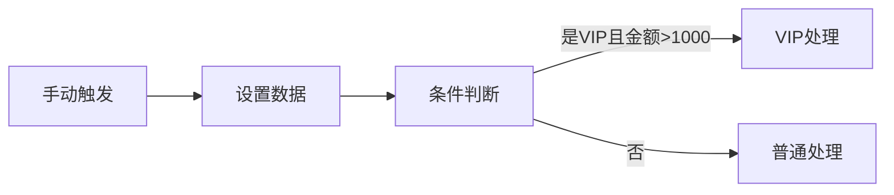

分支处理核心配置：
```json
{
  "parameters": {
    "conditions": {
      "conditions": [
        {
          "leftValue": "={{ $json.用户类型 }}",
          "rightValue": "VIP",
          "operator": {
            "type": "string",
            "operation": "equals"
          }
        }
      ],
      "combinator": "and"
    }
  },
  "name": "条件判断",
  "type": "n8n-nodes-base.if"
}
```

### 9.3 循环处理配置示例

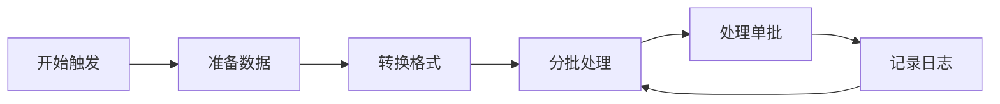

循环处理核心配置：
```json
{
  "parameters": {
    "batchSize": 2,
    "options": {}
  },
  "name": "分批处理", 
  "type": "n8n-nodes-base.splitInBatches"
}
```

**关键特性**：
- **batchSize**: 每批处理的数据量
- **自动循环**: 处理完成后自动返回分批节点
- **批次上下文**: 维护批次状态和进度

### 9.4 数据聚合配置示例

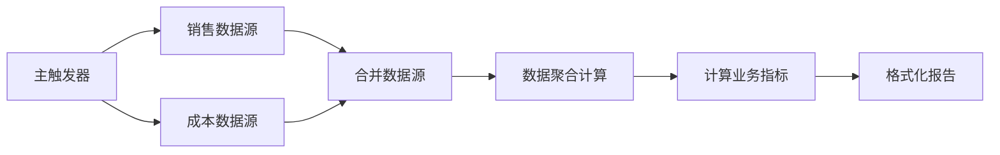

聚合处理核心配置：
```json
{
  "parameters": {
    "aggregate": "aggregateAllItemData",
    "fieldsToAggregate": {
      "fieldToAggregate": [
        {
          "fieldToAggregate": "Q1销售额,Q2销售额,Q3销售额,Q4销售额",
          "operation": "sum",
          "outputFieldName": "年度总销售额"
        },
        {
          "fieldToAggregate": "Q1销售额,Q2销售额,Q3销售额,Q4销售额",
          "operation": "average", 
          "outputFieldName": "季度平均销售额"
        }
      ]
    }
  },
  "name": "数据聚合计算",
  "type": "n8n-nodes-base.aggregate"
}
```

**支持的聚合操作**：
- **sum**: 求和
- **average**: 平均值
- **max/min**: 最大/最小值
- **count**: 计数
- **concatenate**: 字符串拼接

### 9.5 连接关系配置

连接关系定义了数据在节点间的流向：

```json
{
  "connections": {
    "条件判断": {
      "main": [
        [
          {
            "node": "VIP处理",
            "type": "main",
            "index": 0
          }
        ],
        [
          {
            "node": "普通处理", 
            "type": "main",
            "index": 0
          }
        ]
      ]
    }
  }
}
```

**连接类型**：
- **main**: 主要数据流
- **index**: 输出端口索引（0=true分支，1=false分支）

### 9.6 表达式和变量引用

n8n支持丰富的表达式语法：

```javascript
// 引用上一节点数据
{{ $json.字段名 }}

// 条件表达式
{{ $json.金额 > 1000 ? 'VIP' : '普通' }}

// 数组操作
{{ $json.items.length }}

// 日期处理
{{ new Date().toISOString() }}

// 字符串处理
{{ $json.name.toUpperCase() }}
```

### 9.7 错误处理配置

```json
{
  "parameters": {
    "rules": {
      "rule": [
        {
          "type": "expression",
          "value": "={{ $json.error === undefined }}"
        }
      ]
    },
    "errorOutput": {
      "mode": "separate"
    }
  },
  "name": "错误处理",
  "type": "n8n-nodes-base.if"
}
```

### 9.8 配置最佳实践

#### 9.8.1 命名规范
- **节点名称**: 使用描述性中文名称
- **变量名称**: 采用驼峰命名或下划线
- **ID生成**: 使用UUID确保唯一性

#### 9.8.2 性能优化
- **批处理大小**: 根据数据量和系统性能调整
- **并行处理**: 合理使用Split Out节点
- **内存管理**: 避免在单个节点处理过大数据集

#### 9.8.3 维护性考虑
- **模块化设计**: 将复杂逻辑拆分为多个节点
- **注释说明**: 在meta字段添加详细描述
- **版本控制**: 记录配置变更历史

## 10. 高级配置技巧

### 10.1 动态参数配置

```json
{
  "parameters": {
    "url": "={{ $json.baseUrl }}/api/{{ $json.endpoint }}",
    "options": {
      "timeout": "={{ $json.timeout || 30000 }}"
    }
  }
}
```

### 10.2 条件执行

```json
{
  "parameters": {
    "conditions": {
      "boolean": [
        {
          "value1": "={{ $runIndex === 0 }}",
          "value2": true
        }
      ]
    }
  }
}
```

### 10.3 数据转换管道

```json
{
  "parameters": {
    "jsCode": "return $input.all().map(item => ({\n  json: {\n    ...item.json,\n    processed: true,\n    timestamp: new Date().toISOString()\n  }\n}));"
  }
}
```

这些配置示例展示了n8n在实际应用中的灵活性和强大功能，为构建复杂的自动化工作流提供了坚实的技术基础。

## 11. 节点间数据传递机制详解

### 11.1 数据传递基本原理

根据[n8n数据结构文档](https://docs.n8n.io/data/data-structure/)，n8n中的数据以JSON格式在节点间传递，每个数据项包含：

```json
{
  "json": {
    // 主要数据内容
  },
  "binary": {
    // 二进制数据（可选）
  }
}
```

### 11.2 直接连接传递

最基础的数据传递方式：

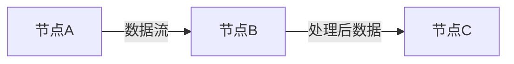

**特点**：
- 数据自动传递，无需额外配置
- 保持数据的完整性和连续性
- 适用于线性处理流程

### 11.3 表达式引用数据

基于[n8n社区讨论](https://community.n8n.io/t/how-to-pass-variables-between-nodes-especially-for-distant-nodes/81713)，可以引用非直连节点的数据：

```javascript
// 引用特定节点的数据
{{ $node["数据源节点"].json["字段名"] }}

// 引用特定节点的所有数据项
{{ $node["数据源节点"].all() }}

// 引用当前项数据
{{ $json.字段名 }}

// 条件引用
{{ $node["节点名"].json.amount > 1000 ? "高额" : "普通" }}
```

**注意事项**：
- 被引用的节点必须已执行
- 引用节点不在执行路径上可能导致数据缺失
- 建议使用Merge节点确保数据可用性

### 11.4 Merge节点合并策略

Merge节点提供多种合并模式：

#### 11.4.1 组合所有数据 (combineAll)

```json
{
  "parameters": {
    "mode": "combine",
    "combineBy": "combineAll",
    "options": {}
  }
}
```

**效果**：将所有输入数据项组合为一个数组

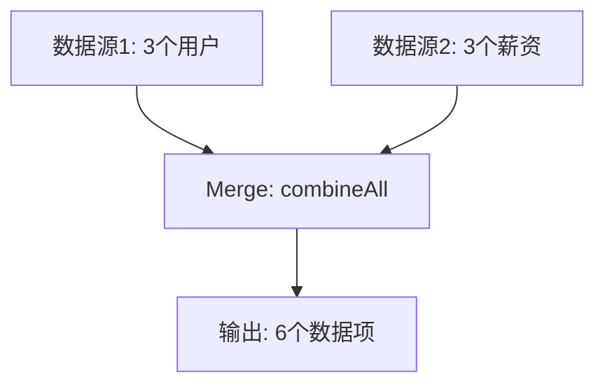

#### 11.4.2 按位置合并 (combineByPosition)

```json
{
  "parameters": {
    "mode": "combine", 
    "combineBy": "combineByPosition",
    "options": {}
  }
}
```

**效果**：按索引位置配对合并

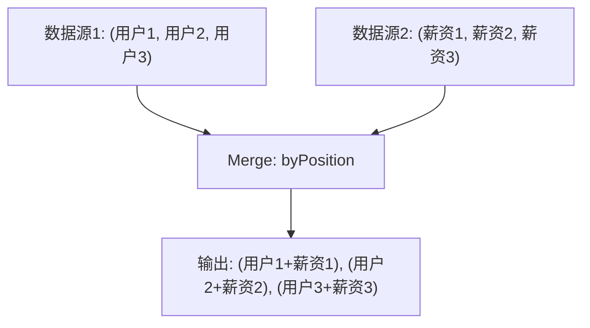

#### 11.4.3 手动关联合并

使用Code节点实现自定义合并逻辑：

```javascript
// 根据ID关联合并数据
const allItems = $input.all();
const userData = allItems.filter(item => item.json.数据来源 === '用户信息');
const salaryData = allItems.filter(item => item.json.数据来源 === '薪资信息');

const mergedData = userData.map(userItem => {
  const user = userItem.json;
  const salary = salaryData.find(salaryItem => 
    salaryItem.json.user_id === user.id
  )?.json;
  
  return {
    json: {
      ...user,
      salary: salary?.amount || 0,
      total_compensation: user.base_salary + (salary?.bonus || 0)
    }
  };
});

return mergedData;
```

### 11.5 处理二进制数据传递

根据[n8n社区二进制数据讨论](https://community.n8n.io/t/how-to-pass-n8n-binary-data-file-between-nodes/30564)，二进制数据传递需要特殊处理：

#### 11.5.1 二进制数据引用

```javascript
// 引用二进制数据
{{ $node["HTTP下载"].binary.data }}

// 通过Merge节点传递二进制数据
```

#### 11.5.2 二进制数据保持

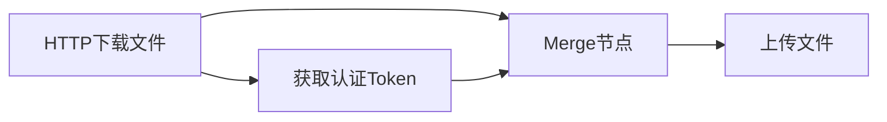

**配置示例**：
```json
{
  "parameters": {
    "mode": "combine",
    "combineBy": "combineAll",
    "options": {
      "includeUnpaired": true
    }
  },
  "name": "保持二进制数据",
  "type": "n8n-nodes-base.merge"
}
```

### 11.6 跨工作流数据传递

基于[工作流间传递变量讨论](https://community.n8n.io/t/how-to-pass-variables-between-workflows-in-n8n/111114)：

#### 11.6.1 Execute Sub-workflow

```json
{
  "parameters": {
    "workflowId": "child-workflow-id",
    "waitForExecution": true
  },
  "name": "调用子工作流",
  "type": "n8n-nodes-base.executeWorkflow"
}
```

#### 11.6.2 子工作流接收数据

在子工作流中使用触发器：
```json
{
  "parameters": {
    "options": {}
  },
  "name": "子工作流触发器",
  "type": "n8n-nodes-base.executeWorkflowTrigger"
}
```

### 11.7 数据传递最佳实践

#### 11.7.1 确保数据可用性

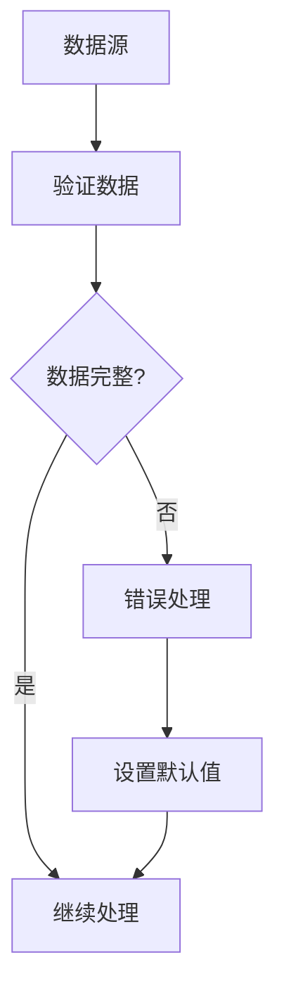

#### 11.7.2 处理执行顺序

根据社区讨论，多分支工作流按从上到下的顺序执行：

```json
{
  "settings": {
    "executionOrder": "v1"
  }
}
```

#### 11.7.3 数据类型转换

```javascript
// 确保数据类型正确
const processedData = $input.all().map(item => ({
  json: {
    id: parseInt(item.json.id),
    amount: parseFloat(item.json.amount),
    date: new Date(item.json.date).toISOString(),
    status: String(item.json.status).toLowerCase()
  }
}));
```

### 11.8 常见数据传递问题解决

#### 11.8.1 节点未执行问题

**问题**：引用的节点不在执行路径上
**解决方案**：
1. 使用Merge节点确保节点执行
2. 重新设计工作流连接
3. 使用Sub-workflow分离逻辑

#### 11.8.2 数据丢失问题

**问题**：数据在传递过程中丢失
**解决方案**：
```javascript
// 数据验证和恢复
const validateData = (data, fallback = {}) => {
  return data && Object.keys(data).length > 0 ? data : fallback;
};

const safeData = validateData($json, {
  id: 0,
  name: '未知',
  status: '待处理'
});
```

#### 11.8.3 大数据量处理

**问题**：大量数据导致内存不足
**解决方案**：
1. 使用Split in Batches节点分批处理
2. 清理不需要的数据字段
3. 使用流式处理

```javascript
// 数据精简
const streamlinedData = $input.all().map(item => ({
  json: {
    // 只保留必要字段
    id: item.json.id,
    key_field: item.json.key_field,
    result: item.json.calculation_result
  }
}));
```

这些数据传递机制为构建复杂的n8n工作流提供了强大的基础，确保数据在各个节点间正确、高效地流转。

---

*本报告基于2024年12月的技术状态和实践经验编写，技术细节可能随版本更新而变化。建议读者结合最新官方文档进行实际部署。* 