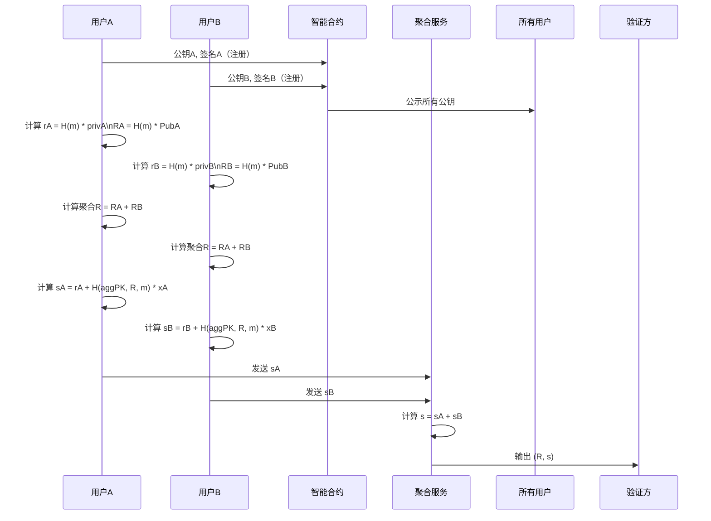

# 免交互 Schnorr 多签方案

## 背景与动机

Schnorr 多签（MultiSig）因其线性特性，天然适合签名聚合。但传统 Schnorr 多签（如 MuSig）需要多轮交互，主要是为了安全地产生随机数 R，防止重放和私钥泄露。本文提出一种**免交互**的 Schnorr 多签方案，结合 HD Wallet 的确定性派生思想，实现无需交互的签名聚合。

## 方案流程

### 1. 多签成员注册
- 每个成员用自己的私钥对一段字符串（如“我要加入多签组”+组ID）签名，提交公钥和签名到智能合约。
- 智能合约验证签名，公示所有已注册公钥。

### 2. 确定性生成 R（核心公式推导）
- 传统 Schnorr 签名的 R 是随机生成的：R = r·G。
- 本方案采用确定性生成方式，具体推导如下：

  设 H(m) 为消息 m 的哈希（可为 HMAC 或普通 hash），privA 为用户 A 的私钥，PubA = privA * G 为公钥，则：

  ```
  rA = H(m) * privA
  RA = rA * G = (H(m) * privA) * G = H(m) * (privA * G) = H(m) * PubA
  ```

- 也就是说，RA 可以直接由消息哈希和公钥计算得到，只要知道 PubA 和 m，任何人都能算出 RA。
- 这样，所有成员都能独立算出自己的 Ri 和聚合 R，无需交互。

**安全建议：**
- 建议 H(m) 里加入 group_id、nonce 等唯一性信息，防止重放攻击。
- 这种确定性 R 的方式，理论上只要消息唯一就不会有私钥泄露风险，但如果消息可控或有碰撞风险，需谨慎。

### 3. 计算聚合 R
- 聚合点 R = R1 + R2 + ... + Rn
- 所有成员都能独立算出聚合 R。

### 4. 计算签名 si
- 每个成员计算自己的 si：
  ```
  si = ri + H(agg_pubkey, R, m) * xi
  ```
  其中 xi 是私钥，agg_pubkey 是所有公钥的聚合。
- 每个成员将 si 发送给聚合服务。

### 5. 聚合签名
- 聚合服务收集所有 si，计算：
  ```
  s = s1 + s2 + ... + sn
  ```
- 最终 Schnorr 签名为 (R, s)。

### 6. 验证
- 验证方用聚合公钥和 (R, s) 验证 Schnorr 签名。

## 流程图



## 优点与注意事项

### 优点
- **无需交互**：每个成员可独立计算 Ri 和 si，无需多轮通信。
- **高效**：签名聚合后，链上只需验证一次 Schnorr 签名，节省空间和计算。
- **隐私性**：聚合签名与普通签名无差别，提升隐私。

### 注意事项
- **确定性 R 的安全性**：需确保每次签名的消息唯一，防止同一私钥对不同消息使用相同 R 导致私钥泄露。
- **抗重放**：建议 message 中包含时间戳、nonce 或交易唯一标识。
- **聚合公钥**：可采用简单相加或 MuSig 的加权聚合方式，防止“Rogue Key Attack”。

## 安全性分析与攻击面

### 主要攻击方式

- **随机数重用攻击（Nonce Reuse Attack）**：
  - 若同一私钥对不同消息使用相同随机数 r，会导致私钥泄露。
  - 本方案采用 rA = H(m) * privA，若 H(m) 输入唯一且安全，则不会重用 r。
  - 防护建议：H(m) 必须包含唯一性信息（如 group_id、nonce、时间戳等），并选用安全哈希函数。

- **伪造攻击（Forgery）**：
  - Schnorr 签名在安全哈希和离散对数难题假设下不可伪造。

- **流氓公钥攻击（Rogue Key Attack）**：
  - 多签聚合公钥时，恶意参与者可提交特殊公钥。
  - 本方案要求每个成员用私钥签名注册，智能合约验证，能有效防止此类攻击。

- **侧信道攻击（Side-Channel Attack）**：
  - 通过分析实现过程中的物理信号（如时间、功耗）窃取私钥。
  - 实现时需注意常数时间运算、避免泄露敏感信息。

- **哈希函数弱点（Hash Function Weakness）**：
  - H(m) 必须为抗碰撞的安全哈希函数。

- **相关密钥攻击（Related-Key Attack, RKA）**：
  - 研究表明，标准 Schnorr 签名在强 RKA 模型下并不安全，但可通过协议细节修正（如密钥派生、注册证明）提升安全性。
  - 参考：[On the Security of the Schnorr Signature Scheme and DSA against Related-Key Attacks](https://eprint.iacr.org/2015/1135)

### 本方案的防护建议

- H(m) 输入应包含消息、group_id、nonce、公钥等，确保唯一且不可控。
- 每个签名组，可以基于BIP32方式，先生成R0，签名的Ri=H(m)*R0，而不是直接使用PubA
- 选用安全哈希算法（如 SHA-256）。
- 每个公钥注册时需证明私钥所有权，防止流氓公钥。
- 实现时注意抗侧信道攻击。
- 定期安全审计，参考业界最佳实践。

## 参考文献
- [A brief intro to Bitcoin Schnorr Multi-signatures](https://medium.com/hackernoon/a-brief-intro-to-bitcoin-schnorr-multi-signatures-b9ef052374c5)
- [How Schnorr signatures may improve Bitcoin](https://specter.solutions/how-schnorr-signatures-may-improve-bitcoin/)
- [Exploring the Schnorr Signature: A Cornerstone of Modern Cryptography](https://www.onlinehashcrack.com/guides/cryptography-algorithms/exploring-the-schnorr-signature-a-cornerstone-of-modern-cryptography.php)
- [On the Security of the Schnorr Signature Scheme and DSA against Related-Key Attacks](https://eprint.iacr.org/2015/1135)
- [Wikipedia: Schnorr signature](https://en.wikipedia.org/wiki/Schnorr)
