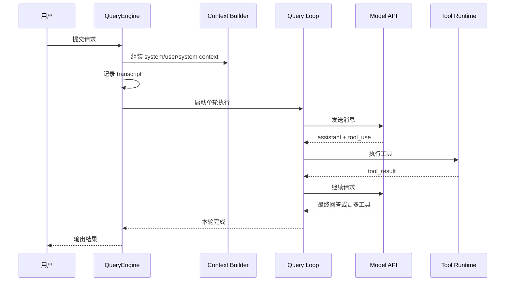
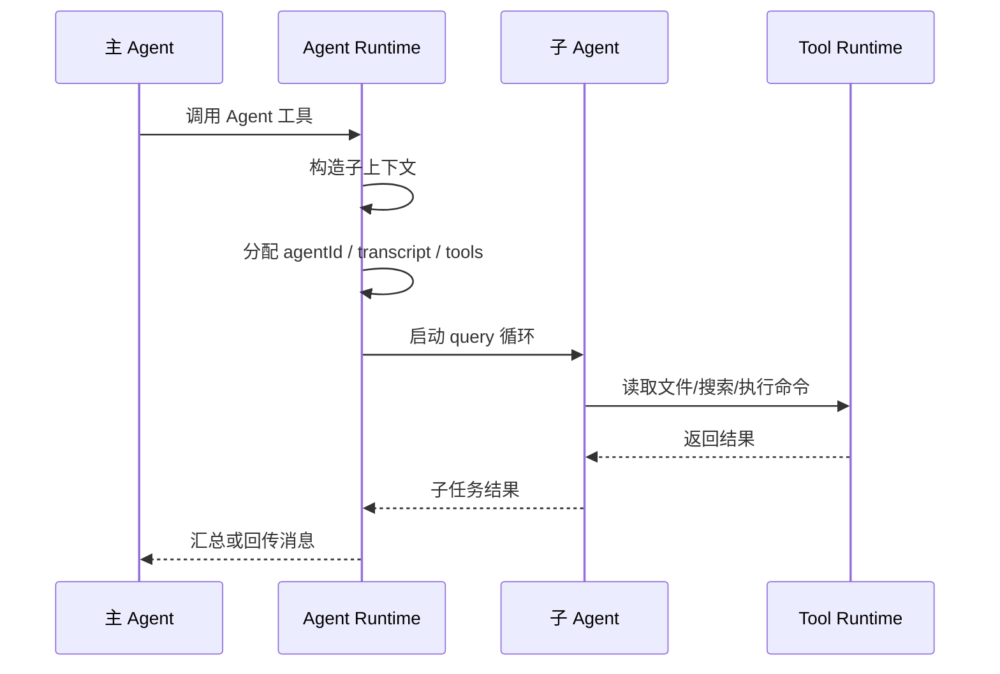
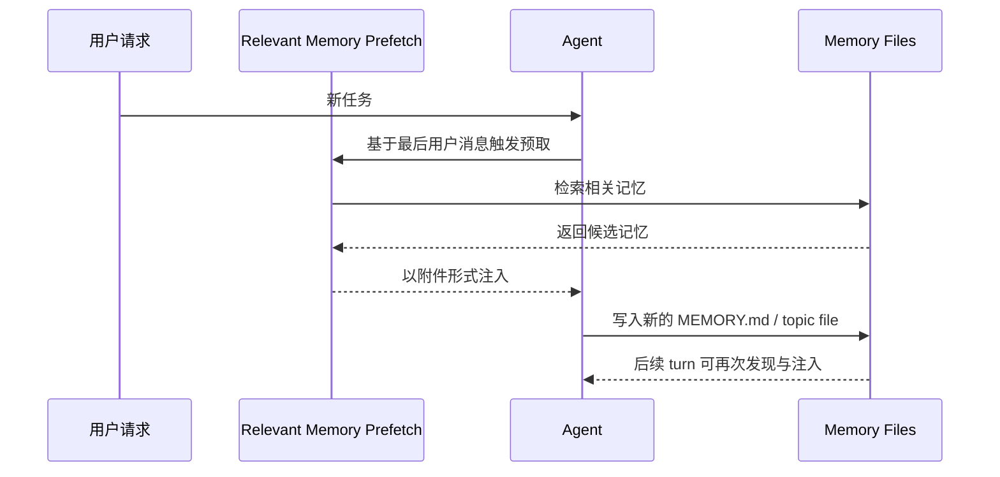
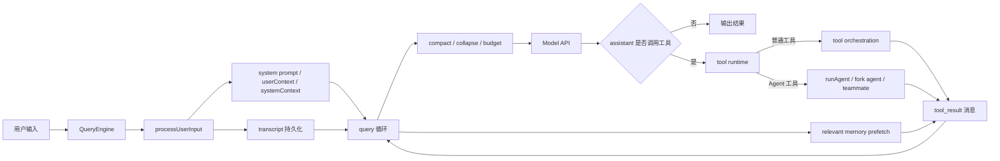

# Claude Code 技术方案说明

本文档不是源码导读，而是从**系统设计**角度解释 Claude Code 的工作方式。目标是让读者**即使不看代码**，也能理解它如何接收任务、组织上下文、调度工具、拆分子 Agent、并发执行以及写回记忆。

---

## 1. 一句话概括

Claude Code 可以理解为一个**带状态的 Agent 运行时**：

- 上层是一个**对话编排器**，负责把用户输入变成一轮轮可执行的推理任务。
- 中层是一个**工具执行框架**，负责把模型产生的 `tool_use` 变成真实的文件读写、Shell、Git、MCP、子 Agent 等操作。
- 底层是一个**状态与持久化层**，负责 transcript、任务、记忆目录、权限状态、文件缓存和运行中任务。

它不是“单次问答 + 调工具”，而是一个**持续迭代的闭环系统**：  
**收集上下文 -> 调模型 -> 执行工具 -> 把结果喂回模型 -> 继续决策 -> 直到完成。**

---

## 2. 设计目标

从技术方案上看，这套系统主要解决 6 个问题：

1. **让模型持续工作，而不是一次性回答。**  
   模型可以多轮调用工具，逐步逼近任务完成。

2. **让上下文可控，不因长会话失控。**  
   通过 compact、collapse、预算限制、记忆预取等机制控制 token 和上下文膨胀。

3. **让工具调用既安全又高效。**  
   对工具做权限判断、并发安全判断、结果大小限制、失败中断与重试。

4. **让 Agent 可以拆分成多个角色协作。**  
   支持创建子 Agent / teammate，让大任务分治而不是全塞给一个主模型。

5. **让系统可恢复、可追踪。**  
   transcript、task output、agent metadata、sidechain transcript 都会落盘。

6. **让“记忆”成为受控输入，而不是无限历史。**  
   记忆按目录、类型、作用域、触发方式来管理，而不是简单把所有历史塞进上下文。

---

## 3. 系统分层

从架构上，可以把 Claude Code 分成 5 层：

### 3.1 入口编排层

职责：

- 接收用户输入
- 识别 slash command、附件、meta message
- 组装一轮执行所需的上下文
- 决定本轮是否真的需要发起模型请求

代表模块：

- `src/QueryEngine.ts`
- `src/utils/processUserInput/`

这层的核心思想是：**先把“用户说了什么”转成“系统这一轮该怎么执行”**。

### 3.2 推理循环层

职责：

- 驱动模型请求
- 接收 assistant 输出
- 识别工具调用
- 执行工具并回填结果
- 控制是否继续下一轮

代表模块：

- `src/query.ts`

这层相当于系统的**主状态机**。

### 3.3 工具执行层

职责：

- 根据 tool name 找到具体工具
- 检查权限
- 判定是否可并发
- 运行工具并收集结果
- 把工具结果包装成模型可继续消费的消息

代表模块：

- `src/services/tools/toolOrchestration.ts`
- `src/services/tools/StreamingToolExecutor.ts`
- `src/Tool.ts`

这层解决的是：**模型产生的是意图，系统要把意图变成真实副作用。**

### 3.4 状态与持久化层

职责：

- 保存会话 transcript
- 保存 task 输出
- 保存 agent 元数据
- 跟踪权限状态、文件缓存、任务列表
- 支持 resume / 恢复

代表模块：

- `src/utils/sessionStorage.ts`
- `src/utils/tasks.ts`
- `src/Task.ts`

这层让系统从“聊天机器人”变成了“长期运行工具”。

### 3.5 记忆与上下文层

职责：

- 提供用户级 / 项目级 / agent 级记忆
- 提供 git 状态、日期、CLAUDE.md、MEMORY.md 等输入
- 按需检索相关记忆，而不是每轮全量注入

代表模块：

- `src/context.ts`
- `src/memdir/memdir.ts`
- `src/tools/AgentTool/agentMemory.ts`
- `src/utils/attachments.ts`

这层的关键设计是：**记忆不是历史日志，而是结构化、按需注入的长期上下文。**

---

## 4. 主执行模型

Claude Code 的核心执行模型可以概括成一句话：

**一个用户请求，会触发一个带状态的 QueryEngine；每次 turn 内部再跑一个 query 循环，直到模型不再继续调用工具。**

### 4.1 外层：会话级状态

会话级状态通常包含：

- 当前消息历史
- 当前工作目录
- 当前模型与 thinking 配置
- 文件读取缓存
- 权限状态
- 已加载的记忆路径
- transcript 持久化状态

这意味着 Claude Code 不是 stateless request/response，而是**conversation runtime**。

### 4.2 内层：单轮闭环

每一轮的基本时序是：

1. 收到用户输入
2. 预处理输入
3. 组装 system prompt + user context + system context
4. 发起模型请求
5. 得到 assistant 输出
6. 如果有工具调用，执行工具
7. 把工具结果回灌给模型
8. 继续下一次模型请求
9. 没有后续动作时结束本轮

这说明它不是“模型回答一次，工具只是外挂”，而是**工具执行本身就是推理循环的一部分**。

### 4.3 为什么要分两层

分成 `submitMessage` 和 `query()` 两层有几个好处：

- **外层**负责会话一致性、transcript、初始化上下文、处理 slash command。
- **内层**负责高频循环，专注于模型-工具-模型闭环。
- 这样可以把“会话管理”和“单轮执行”解耦，便于 SDK、CLI、REPL 复用。

---

## 5. 任务处理链路

如果把“任务”理解成用户要求系统完成的一项工作，那么它的处理链路可以拆成 4 个阶段。

### 5.1 任务接入

输入可能来自：

- 用户自然语言
- slash command
- 附件
- 子 Agent 回传
- hook 注入的额外上下文

进入系统后，会被标准化成 message，并补上当前上下文。

### 5.2 任务理解

系统不会直接执行，而是先做两件事：

- **构造可供模型理解的执行现场**
- **决定当前哪些工具、权限、记忆、目录是可见的**

也就是说，Claude Code 的“任务理解”不是单靠模型参数，而是**模型 + 当前上下文装配结果**共同决定的。

### 5.3 任务执行

模型在回答过程中，会逐步决定：

- 直接输出文本
- 调用工具读取信息
- 更新任务列表
- 创建子 Agent
- 写入记忆
- 执行 Shell

因此系统的执行不是固定工作流，而是**由模型在工具约束下动态规划**。

### 5.4 任务收敛

一个任务何时结束，不是靠硬编码“步骤都跑完”判断，而是多因素共同决定：

- 模型不再发出工具调用
- 达到 `maxTurns`
- 达到 token 或预算上限
- 用户中断
- 某些 hook 或 continuation guard 阻止继续

这是一种**开放式终止条件**设计，更适合通用 Agent。

---

## 6. “任务”和“Task”的区别

系统里有两个不同层次的“任务”概念，容易混淆。

### 6.1 语义任务

指用户希望系统完成的工作，例如：

- 分析代码库
- 修复 bug
- 写文档
- 开一个 PR

这类任务存在于对话与推理层，是 LLM 理解和分解的对象。

### 6.2 运行时 Task

指系统内部需要管理的异步执行实体，例如：

- bash 进程
- 本地 agent
- 远程 agent
- teammate
- workflow

这类任务存在于运行时层，用于：

- 给 UI 展示状态
- 存储输出文件
- 支持 kill / cleanup
- 跟踪后台工作

因此：

- **语义任务**解决“做什么”
- **运行时 Task**解决“谁在跑、跑到哪、怎么停”

这是 Claude Code 技术方案里的一个重要分层。

---

## 7. 知识与记忆方案

Claude Code 并没有把“知识”只放在一处，而是拆成 4 类来源。

### 7.1 即时上下文

指当前这轮就能直接构造出来的信息：

- 用户输入
- 当前日期
- 当前工作目录
- 当前打开的工程
- 当前会话历史

特点：

- 生命周期短
- 强依赖当前 turn
- 不一定持久化

### 7.2 项目上下文

指与当前代码仓库或项目相关的稳定背景：

- CLAUDE.md
- memory files
- git 状态
- 最近 commit
- 项目目录和规则

特点：

- 生命周期长于单轮会话
- 适合作为前缀输入
- 会被缓存或 memoize

### 7.3 检索式记忆

不是每轮都全量注入，而是根据当前问题**按需触发**：

- 从最后一条真实用户消息提取主题
- 预取相关 memory
- 作为附件在稍后时机注入

这样做的原因很明确：

- 降低首轮延迟
- 避免每轮都塞入大量无关记忆
- 让记忆像“辅助证据”而不是“全部上下文”

### 7.4 作用域记忆

系统还区分不同 scope：

- **user scope**：用户级长期偏好
- **project scope**：当前项目长期知识
- **local scope**：更局部、更临时的运行环境记忆
- **agent scope**：某类子 Agent 专用记忆
- **team scope**：多 Agent 协作共享记忆

这说明 Claude Code 的记忆模型本质上是：

**文件化 + 作用域化 + 按需注入**。

---

## 8. 为什么记忆要做成文件系统

它没有走“内置数据库 + 黑盒召回”的路线，而是大量依赖 `MEMORY.md`、主题文件、team memory 文件夹。这样设计有几个明显好处：

1. **可见性强**  
   记忆是用户和 Agent 都能看见、读写、审计的。

2. **可迁移**  
   不依赖专用存储服务，复制目录即可迁移。

3. **可组合**  
   既可以由模型写，也可以由用户手工修改、由其他工具生成。

4. **更适合 coding agent**  
   对代码代理来说，文件系统本来就是天然工作面。

代价是：

- 需要严格限制格式和规模
- 需要避免重复加载
- 需要防止“记忆文件本身变成上下文垃圾”

所以系统里才会出现：

- `MEMORY.md` 截断限制
- nested memory 去重
- relevant memory surfaced bytes 上限
- 明确的 memory type 约束

---

## 9. 任务如何分解

Claude Code 不是先把任务编译成固定 DAG，再逐节点执行。它采用的是**LLM 驱动的动态分解**。

### 9.1 分解原则

模型在每一步会判断：

- 是否还缺信息
- 应该自己继续思考，还是调用工具
- 应该继续串行推进，还是拆给子 Agent
- 当前结果是否足够收敛

因此任务分解是一种**在线规划**，不是离线计划。

### 9.2 分解载体

系统里主要有两种分解载体：

- **Todo / Task 列表**  
  用于把复杂工作外显成可跟踪项。

- **Agent 工具**  
  用于把某个子问题交给新的执行单元。

前者偏**可视化管理**，后者偏**真正委托执行**。

### 9.3 为什么不是全靠一个主 Agent

因为单 Agent 处理大任务会遇到几个问题：

- 上下文变得太大
- 不同子问题需要不同工具集和权限
- 长时间串行执行延迟高
- 某些步骤天然可以独立进行

所以子 Agent 机制不是“锦上添花”，而是为了解决：

**上下文隔离、角色专门化、并发提速、失败局部化。**

---

## 10. 子 Agent 技术方案

### 10.1 子 Agent 是什么

子 Agent 可以理解为：

**由主 Agent 发起的一个新的、隔离的、可选异步运行的推理会话。**

它不是简单函数调用，而是拥有自己：

- agentId
- prompt
- 上下文
- 工具集合
- transcript
- 权限视图
- 任务输出

### 10.2 创建流程

当主 Agent 决定调用 Agent 工具时，系统会：

1. 选定 `AgentDefinition`
2. 决定该 Agent 的模型、权限模式、工具范围
3. 构造子上下文
4. 复制或裁剪父上下文
5. 为其建立独立 transcript / metadata
6. 启动新的 query 循环

### 10.3 隔离策略

`createSubagentContext` 的核心设计思想是：  
**默认隔离，按需共享。**

默认隔离的内容包括：

- readFileState
- nested memory tracking
- discovered skills
- query chain
- 大部分 UI 状态更新回调

按需共享的内容包括：

- 某些 `setAppState`
- response length 统计
- abort controller
- attribution 等可安全共享的状态

这是一种很典型的 Agent runtime 设计：  
**宁可默认不共享，也不让子 Agent 污染主 Agent 状态。**

### 10.4 两类子 Agent

从方案上，可以把它分成两种：

- **长生命周期子 Agent**  
  适合真实委托执行，通常通过 `runAgent`。

- **短生命周期 fork agent**  
  适合 session memory、摘要、旁路推理等辅助任务，通常通过 `runForkedAgent`。

区别在于：

- 前者更像“独立工人”
- 后者更像“临时分身”

### 10.5 为什么要有 fork agent

因为有些子任务只是想：

- 借父上下文做快速旁路推理
- 尽量命中 prompt cache
- 不想完整复制一个重型子会话

所以才有 `cacheSafeParams` 这类设计，核心目标是：

**在不破坏缓存前缀的前提下，派生出一个便宜的辅助推理分支。**

---

## 11. 并行处理方案

Claude Code 的并行不是一种，而是三种。

### 11.1 工具级并行

同一轮 assistant 如果产生多个 `tool_use`，系统不会一律串行执行，而是先判断：

- 工具是否只读
- 工具是否声明 `isConcurrencySafe`
- 是否与其它工具存在共享状态风险

满足条件的工具会被批量并行执行。

这是一种**保守并行**策略：

- 安全时并行
- 不确定时串行

其目标不是极限吞吐，而是**在安全前提下提速**。

### 11.2 流式并行

在模型边输出边产生工具调用时，`StreamingToolExecutor` 可以做到：

- 新工具块一到就入队
- 满足条件就立刻启动
- 结果按原始顺序回灌
- 某个关键错误可中止兄弟工具

这解决的是“边生成边执行”的问题，降低端到端等待。

### 11.3 Agent 级并行

多子 Agent / teammate / swarm 可以同时推进不同子问题。

这种并行和工具级并行的区别是：

- 工具级并行：同一轮内、同一会话里，多个工具一起跑
- Agent 级并行：多个会话或执行实体各自推进

Agent 级并行更适合：

- 搜索不同区域
- 同时做实现与验证
- 背景总结与主任务并行

---

## 12. 为什么并行还要这么保守

因为 coding agent 的副作用很重，随便并发可能出问题：

- 两个写文件工具同时修改同一文件
- 一个工具依赖另一个工具的输出
- 两个 Shell 命令争抢同一工作目录或资源
- 工具结果返回顺序错乱，模型理解上下文出错

所以系统采用的不是“只要能跑就并行”，而是：

**把并行建立在可证明安全的前提上。**

这也是为什么它要先做批次切分，再决定 `concurrent` 还是 `serial`。

---

## 13. 记忆如何更新

Claude Code 的记忆更新，不是“模型内部参数更新”，而是**外部工作记忆写入**。

### 13.1 更新本质

更新动作通常表现为：

- 写 `MEMORY.md`
- 写某个 topic memory file
- 编辑 team memory
- 更新 agent memory 目录

所以“更新记忆”的本质是：

**把这次任务中值得长期保留的信息，固化成可再次检索的文件。**

### 13.2 为什么不用自动全量写记忆

如果每次对话都自动沉淀全部内容，会出现几个问题：

- 噪音远大于价值
- 很快污染长期上下文
- 以后召回时难以区分重要性

因此系统用的是**受控写入模型**：

- 有明确的 memory type
- 有 scope
- 有目录结构
- 有大小和格式约束

### 13.3 更新后的消费路径

写入后的记忆不会立即总是全量回注，而是通过几种方式重新进入系统：

- 下次 `getUserContext` / `getMemoryFiles`
- relevant memory 检索
- 子 Agent 自身 memory scope
- team memory 搜索与读取

所以 Claude Code 的记忆闭环是：

**写文件 -> 被发现 -> 被筛选 -> 被注入 -> 再参与推理**

而不是简单“写完就常驻上下文”。

---

## 14. 上下文控制方案

长会话 Agent 最大的问题之一是上下文爆炸，Claude Code 在这方面用了多层控制。

### 14.1 前缀控制

system prompt、user context、system context 分开构造，便于：

- 单独缓存
- 单独裁剪
- 子 Agent 做定制化省略

### 14.2 结果大小控制

工具结果在进消息前会做预算控制，避免某次工具返回过大内容，把后续轮次全部拖垮。

### 14.3 历史压缩

系统内有多种压缩机制：

- snip
- microcompact
- autocompact
- context collapse

这些机制本质上是在做一件事：  
**保留继续推理所需的信息，丢弃或折叠低价值细节。**

### 14.4 记忆延迟注入

relevant memory 预取不是首轮强阻塞，而是后台异步准备，成熟后再注入。

这体现出一个明确的工程取舍：

- 首响应速度比“先把一切都准备完”更重要
- 记忆应该按收益注入，而不是按完整性注入

---

## 15. 一致性与恢复方案

Claude Code 之所以像一个“开发工具”而不只是聊天机器人，一个关键原因是它很重视恢复能力。

### 15.1 Transcript 持久化

用户消息在进入 query 主循环前就会写 transcript。这样即使中途被杀，也能从“用户已发出请求”这一点恢复，而不是整轮丢失。

### 15.2 Task 输出落盘

后台任务、Shell、Agent 等通常有自己的 output file，便于：

- UI 追踪
- 恢复查看
- 后续消费

### 15.3 Sidechain transcript

子 Agent、fork agent、后台总结等旁路推理可以使用 sidechain transcript，这意味着：

- 主会话和旁路会话可分离
- 既能追踪，又不把所有消息都塞回主线程

### 15.4 为什么这很重要

因为 coding 场景中的任务常常：

- 执行时间长
- 会跑后台进程
- 会被用户中断
- 需要 resume

所以恢复不是附加能力，而是主方案的一部分。

---

## 16. 安全与权限方案

Claude Code 不是把所有工具都裸露给模型，而是围绕权限做了多层控制。

### 16.1 工具许可判断

每次工具调用前都会经过 `canUseTool` 判断，决定：

- 允许
- 拒绝
- 是否需要提示用户

### 16.2 子 Agent 权限收缩

子 Agent 不会天然继承主 Agent 的全部权限，系统可以：

- 切换权限模式
- 限制工具集合
- 避免后台 Agent 弹权限框

### 16.3 为什么权限和并发要一起设计

因为一旦允许子 Agent 并行执行，如果权限边界不清晰，就可能出现：

- 后台 Agent 静默执行高风险操作
- 工具范围泄漏
- 主线程批准意图被子线程误继承

所以 Claude Code 的权限设计并不是单点校验，而是和：

- Agent 隔离
- 并发模型
- AppState 共享策略

绑在一起设计的。

---

## 17. 典型时序图

### 17.1 主任务执行时序

### 17.2 子 Agent 委托时序

### 17.3 记忆闭环时序

---

## 18. 一次真实请求的逐步拆解

这一节用“用户说一句话后，系统内部到底发生了什么”来解释整套方案。

假设用户输入的是：

> 帮我分析这个仓库的主流程，并整理成文档

### 18.1 第一步：进入会话入口

请求首先进入 `QueryEngine.submitMessage`。这一步并不会马上调用模型，而是先做会话级准备：

- 设置当前工作目录
- 初始化或继承本次 turn 要使用的 `AbortController`
- 包装 `canUseTool`
- 读取当前 `AppState`
- 决定本次 turn 的模型、thinking、预算等参数

这一步的技术含义是：

**先确定“这轮执行的运行环境”，再开始真正推理。**

### 18.2 第二步：构造上下文前缀

随后系统会并行准备 3 类关键输入：

- `defaultSystemPrompt`
- `userContext`
- `systemContext`

其中：

- `userContext` 更偏用户/项目视角，例如 CLAUDE.md、memory、日期
- `systemContext` 更偏运行时/环境视角，例如 git 快照

这一步的设计重点有两个：

1. **前缀拆分**  
   system prompt、本地记忆、环境快照不是揉成一坨，而是分别构造。

2. **并行拉取**  
   这些输入之间大多无依赖，因此用 `Promise.all` 缩短入口延迟。

### 18.3 第三步：处理输入而不是直接提问

接下来进入 `processUserInput`。它做的不是“问模型你怎么看”，而是把原始用户输入转成系统可执行对象。

它可能会：

- 识别 slash command
- 生成 attachment message
- 调整允许工具集合
- 直接在本地完成某些命令
- 决定 `shouldQuery` 是否为真

这说明 Claude Code 的入口不是传统聊天模型的“收到文本就发 API”，而是：

**先做本地解释，再决定是不是需要远程推理。**

### 18.4 第四步：先落 transcript，再进主循环

消息准备完成后，会先写 transcript，再进入 query 循环。

这个顺序非常关键，因为它意味着：

- 即使后面模型请求还没返回
- 即使用户马上中断
- 即使进程意外退出

系统仍然知道“这一条用户请求已经被接收”。

这是一个典型的工程化选择：  
**优先保证恢复能力，而不是把所有写盘都延后。**

### 18.5 第五步：启动单轮 query 循环

进入 `query()` 后，系统开始准备本轮真正发给模型的消息窗口。

这一步通常会依次处理：

- compact boundary 之后的有效消息
- tool result budget
- snip
- microcompact
- context collapse
- autocompact

可以把它理解成：

**真正发请求前，先把“历史上下文”裁剪成当前最值得保留的工作集。**

### 18.6 第六步：后台并发准备辅助信息

在主循环开始时，系统还会做一些不阻塞主路径的后台动作，例如：

- `startRelevantMemoryPrefetch`
- skill discovery prefetch

这类动作的共同特点是：

- 对后续轮次有价值
- 但不值得阻塞当前首请求

这是 Claude Code 很典型的一个设计思想：  
**高价值但非首要的信息，用预取隐藏延迟。**

### 18.7 第七步：向模型发起请求

经过裁剪和准备后，系统把：

- system prompt
- userContext
- systemContext
- 消息窗口
- tool 定义
- 权限与配置

一起发送给模型。

此时模型拿到的不是纯文本聊天历史，而是一个完整的 Agent 工作面。

### 18.8 第八步：处理 assistant 输出

模型返回内容后，系统不会只看文本，还会解析：

- text block
- tool_use block
- 可能的 stream event

如果模型没有发工具调用，那么本轮可能直接进入收敛；如果有，就进入工具执行阶段。

### 18.9 第九步：执行工具

系统会把本轮的 `tool_use` 收集起来，按并发安全性分批执行。

如果是普通路径，使用 `runTools`。

如果是流式工具执行路径，使用 `StreamingToolExecutor`。

这一阶段会做几件关键事：

- 查找工具定义
- 校验输入
- 检查权限
- 判断是否可并发
- 运行工具
- 收集 progress / tool_result

注意这里有一个很重要的设计：

**工具执行并不是副作用“旁路”，它产生的结果会重新变成消息，继续进入主循环。**

### 18.10 第十步：把工具结果回灌给模型

工具执行完成后，系统会把结果包装成新的 user/tool_result message，加入消息流。

于是模型下一轮看到的上下文就变成：

- 之前的推理结果
- 自己刚才发出的工具调用
- 工具返回的真实数据

这本质上是一种**观察-行动-再观察**的循环。

### 18.11 第十一步：必要时创建子 Agent

如果本轮 assistant 没有直接做事，而是调用了 Agent 工具，那么系统会进入子 Agent 路径：

- 选取 agent 定义
- 构造隔离上下文
- 决定工具集合与权限模式
- 启动新的 query 循环
- 将子 Agent 的输出回传给主线程

所以子 Agent 并不是“跳出主流程”，而是**主流程中的一种特殊工具执行形式**。

### 18.12 第十二步：判断是否继续

一轮工具执行后，系统会判断要不要继续：

- 还有没有新的工具调用
- 是否达到 turn 上限
- 是否命中 token / budget 限制
- 是否被 hook 阻止
- 是否已经可以自然结束

所以 query 循环本质上是一个：

**带预算、带压缩、带副作用执行的递归决策循环。**

### 18.13 从这个时序能看出什么

从架构角度，Claude Code 的主方案不是“LLM + tools”，而是：

**状态机 + 上下文装配 + 安全工具运行时 + 多会话执行能力。**

LLM 是决策核心，但不是唯一核心。

---

## 19. 三种执行单元对比

为了看懂 Claude Code 的技术方案，最容易混淆的是下面三类执行单元：

- 主 Agent
- fork agent
- teammate / swarm agent

它们都像“Agent”，但设计目的不同。

### 19.1 总体对比表

| 维度 | 主 Agent | fork agent | teammate / swarm agent |
|------|------|------|------|
| 角色 | 当前会话主执行者 | 主线程派生的轻量旁路推理分支 | 独立协作执行者 |
| 生命周期 | 随会话持续 | 通常较短 | 可较长，可后台运行 |
| 目标 | 完成用户主任务 | 辅助摘要、session memory、旁路分析 | 承接独立子任务 |
| 上下文来源 | 当前会话完整上下文 | 尽量复用父上下文前缀 | 继承后再裁剪/隔离 |
| 是否强调 prompt cache | 一般 | 很强调 | 视场景而定 |
| 是否有独立 transcript | 主 transcript | sidechain transcript | 通常有独立 transcript / metadata |
| 工具集合 | 全量或当前会话允许集合 | 通常与父线程高度一致 | 可按 Agent 定义做特化 |
| 典型用途 | 主流程推进 | 快速补充推理、总结、旁路判断 | 搜索、实现、验证、分治执行 |

### 19.2 主 Agent

主 Agent 就是当前用户正在交互的执行线程。

它的特点是：

- 拥有完整会话状态
- 负责最终面向用户输出
- 决定是否调用工具、子 Agent、记忆写入
- 通常也是权限交互的主入口

可以把它看成系统里的“总控线程”。

### 19.3 fork agent

fork agent 不是为了接管主任务，而是为了做一些：

- 辅助推理
- 轻量摘要
- 旁路实验
- 尽量复用父上下文缓存的短任务

它的关键词是：

- 轻量
- 短期
- cache-friendly

这类执行单元的设计目的不是“更强自治”，而是“更便宜地派生一个推理分支”。

### 19.4 teammate / swarm agent

这类执行单元更像真正的协作者。

特点通常是：

- 可以有自己的执行周期
- 可以通过 mailbox 协作
- 可以并行推进独立子问题
- 更接近“多工人模型”

如果说 fork agent 像“主线程的分身”，teammate 更像“团队里的另一个人”。

### 19.5 为什么要同时保留三种

因为三者解决的问题根本不同：

- 主 Agent：负责统一对外
- fork agent：负责低成本辅助计算
- teammate：负责多实体协作

如果只保留一种，会在下面几个维度上失衡：

- 全都用主 Agent：上下文太大，串行太慢
- 全都用 teammate：开销太高，很多辅助任务不值得
- 全都用 fork agent：难以承载真正长期独立执行

所以这三种执行单元共同构成了 Claude Code 的多层执行模型。

---

## 20. 关键数据结构说明

理解技术方案时，不需要读所有实现，但最好理解 4 个核心数据结构。

### 20.1 `Message`

`Message` 是整个系统的统一交换格式。

它不只是聊天消息，还包括：

- 用户消息
- assistant 消息
- attachment
- progress
- system message
- compact boundary
- tool result 对应的 user message

为什么这很重要：

- 模型输入输出最终都归一到消息流
- 工具执行结果也会回写成消息
- transcript 记录的也是消息

所以整个系统其实是围绕**消息流**在运转。

### 20.2 `ToolUseContext`

`ToolUseContext` 可以看成工具运行时的“执行现场”。

它包含的不是一个单点对象，而是一整组执行能力和状态，例如：

- 当前工具集合
- 当前模型配置
- abortController
- readFileState
- AppState 访问器
- nested memory tracking
- query tracking
- 权限和 UI 回调
- 当前消息列表

它的重要性在于：

- 工具执行不是纯函数
- 子 Agent 运行也依赖它
- 并发、权限、状态更新都通过它传播

可以把 `ToolUseContext` 理解成：

**Agent 执行时的最小运行时内核。**

### 20.3 `AppState`

`AppState` 更像“全局会话状态容器”。

它承载的通常是：

- 权限状态
- 当前任务状态
- 文件历史
- attribution
- UI 相关状态

在主线程里，它连接执行层和 UI/系统状态；在子 Agent 中，又会通过选择性共享或 no-op 包装来避免污染主线程。

也就是说：

- `ToolUseContext` 偏执行现场
- `AppState` 偏全局状态

### 20.4 `TaskState`

`TaskState` 负责描述后台执行实体的运行信息，例如：

- task id
- 类型
- 状态
- 描述
- 起止时间
- 输出文件

它主要服务于：

- 后台任务管理
- UI 展示
- kill / cleanup
- 结果追踪

因此它不是“语义任务结构体”，而是“运行时任务记录”。

---

## 21. 一个更完整的总览图

---

## 22. 五个问题的结论版回答

### 18.1 任务处理流程是什么

它是一个**会话级编排 + 单轮闭环执行**的架构。  
外层负责接入用户请求与维护状态，内层负责“模型决策 -> 工具执行 -> 结果回灌 -> 再决策”。

### 18.2 如何获取任务相关知识/记忆

它通过**前缀上下文 + 文件化记忆 + 按需检索式记忆**三种方式组合获取，不依赖单一记忆中心。

### 18.3 如何分解任务并创建子 Agent

分解是**动态在线规划**，不是固定 DAG。  
当模型判断某个子问题值得独立处理时，会用 Agent 工具启动新的隔离会话。

### 18.4 如何并行处理

并行分为**工具级并行、流式并行、Agent 级并行**。  
整体策略是保守并行：安全就并行，不确定就串行。

### 18.5 如何更新记忆

记忆更新通过**文件写入**完成，记忆本身是结构化、分作用域、可再次检索的长期上下文，而不是模型内部状态。

---

## 23. 关键文件索引

| 主题 | 路径 |
|------|------|
| 查询引擎入口 | `src/QueryEngine.ts` |
| 主循环 | `src/query.ts` |
| 用户/系统上下文 | `src/context.ts` |
| 提示前缀组装 | `src/utils/queryContext.ts` |
| 工具编排与并行 | `src/services/tools/toolOrchestration.ts` |
| 流式工具执行 | `src/services/tools/StreamingToolExecutor.ts` |
| 子 Agent 上下文 | `src/utils/forkedAgent.ts` |
| 运行子 Agent | `src/tools/AgentTool/runAgent.ts` |
| 记忆目录与提示 | `src/memdir/memdir.ts` |
| Agent 记忆 | `src/tools/AgentTool/agentMemory.ts` |
| 相关记忆预取 | `src/utils/attachments.ts` |
| 磁盘任务列表 | `src/utils/tasks.ts` |
| 运行时 Task 类型 | `src/Task.ts` |

---

## 24. 相关文档

如果你想把“主流程”继续往 prompt 组装层看，建议直接配合这些文档一起读：

- [Claude Code 调用栈地图与参数流转]({{ site.baseurl }})
  看按具体源码函数展开的调用栈，以及核心参数对象如何在主线程、工具运行时、子 Agent 之间流转。

- [请求外壳]({{ site.baseurl }})
  看一次完整模型请求到底由哪些层组成。

- [主线程]({{ site.baseurl }})
  看主线程 prompt 的 `system`、`messages`、`tools` 是怎么拼的。

- [普通子 Agent]({{ site.baseurl }})
  看主流程进入子 Agent 后，prompt 结构如何变化。

- [Claude Code 记忆系统技术方案]({{ site.baseurl }})
  看记忆系统如何作为长期上下文接入主流程。

- [Claude Code 子 Agent 系统技术方案]({{ site.baseurl }})
  看任务分解和多 Agent 运行时本身。

---

## 25. 调用栈与参数流转导读

这一部分已经单独拆成文档：

- [Claude Code 调用栈地图与参数流转]({{ site.baseurl }})

如果你想看：

- 主线程到底经过哪些函数
- `query()` 主循环内部到底先后调用哪些模块
- `tool_use -> runToolUse -> tool_result` 的闭环怎么成立
- 普通子 Agent / fork agent 怎么重新进入 `query()`
- `messages`、`systemPrompt`、`userContext`、`systemContext`、`toolUseContext`、`agentId` 怎么在这些函数之间流转

建议直接去看这篇独立文档。

这份主流程文档里只保留一句总括：

**Claude Code 的主流程不是单个大函数，而是 `submitMessage -> queryLoop -> tool runtime -> 子 queryLoop` 这样一层套一层的递归执行模型。**

---

## 26. 适合怎么读这份文档

如果你只关心系统方案，建议按下面顺序看：

1. `第 1~4 节`：先建立整体模型
2. `第 7~13 节`：重点理解记忆、分解、子 Agent、并行
3. `第 15~16 节`：补齐恢复与权限
4. 最后再去看 `关键文件索引`

如果你后面还要继续深入，下一步最值得补的是两类内容：

- **给这份调用栈地图补“关键参数流转表”**
- **单独写一篇“记忆系统技术方案”**
