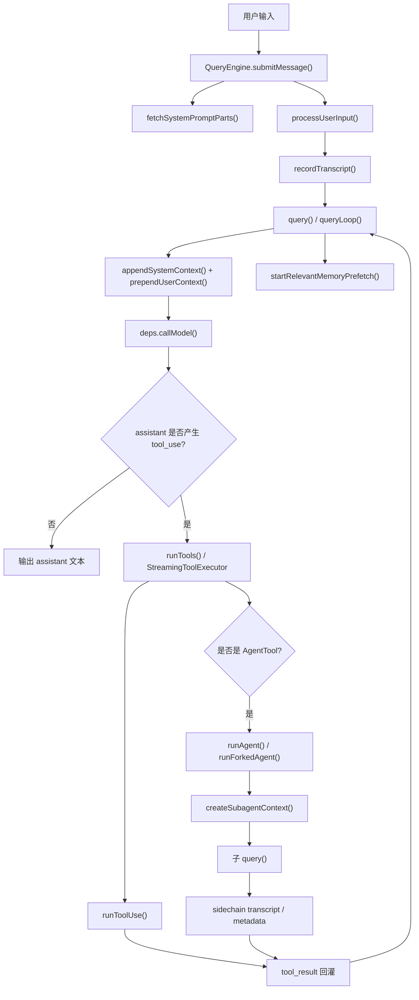
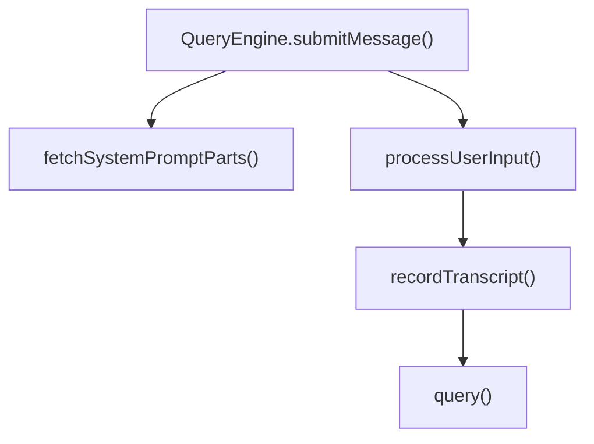
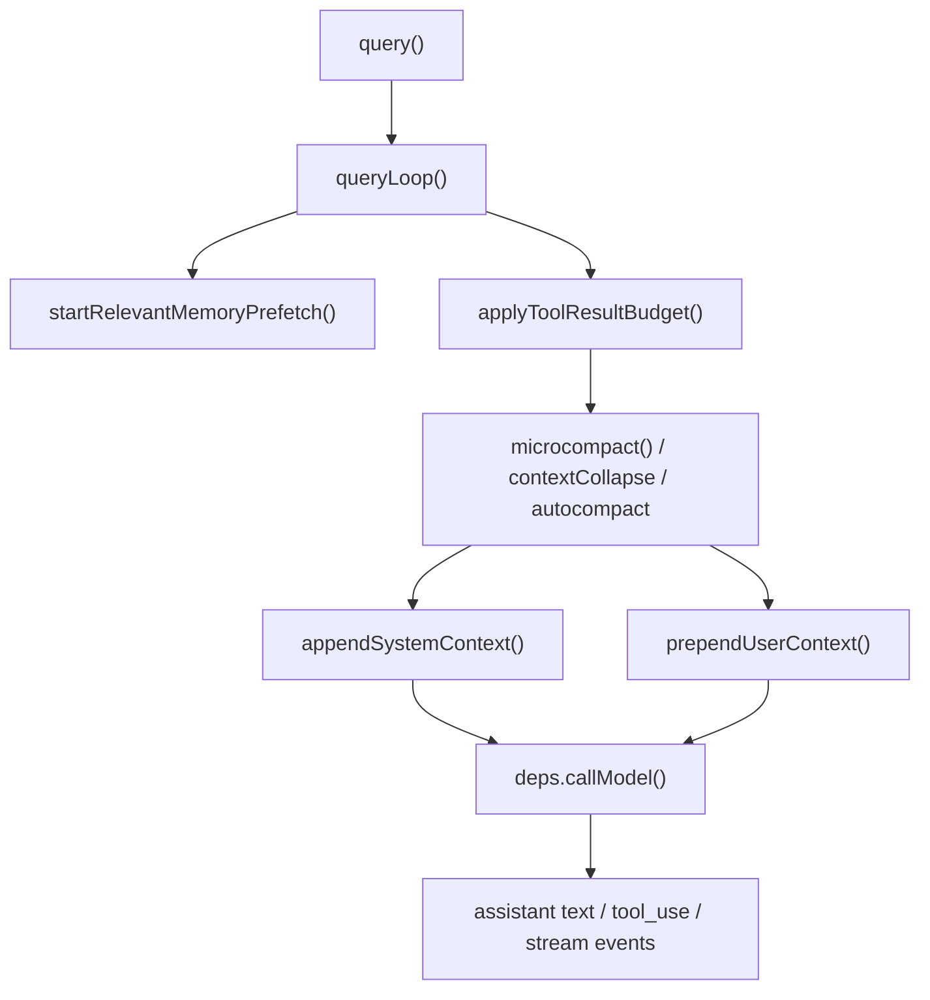
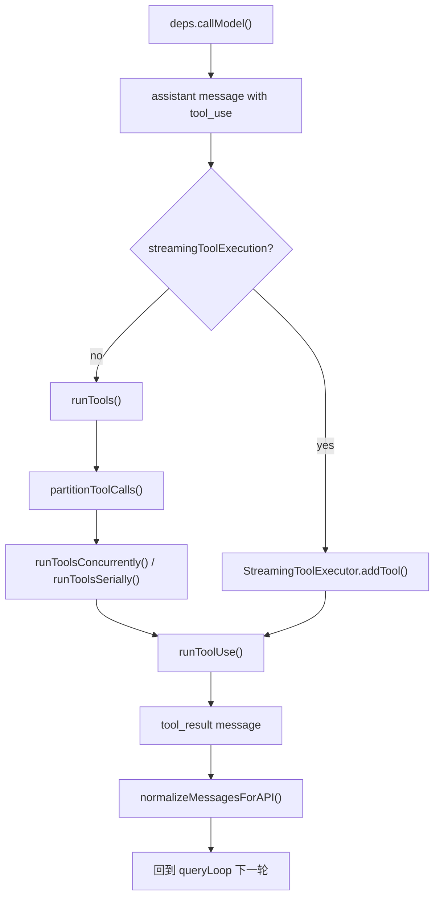
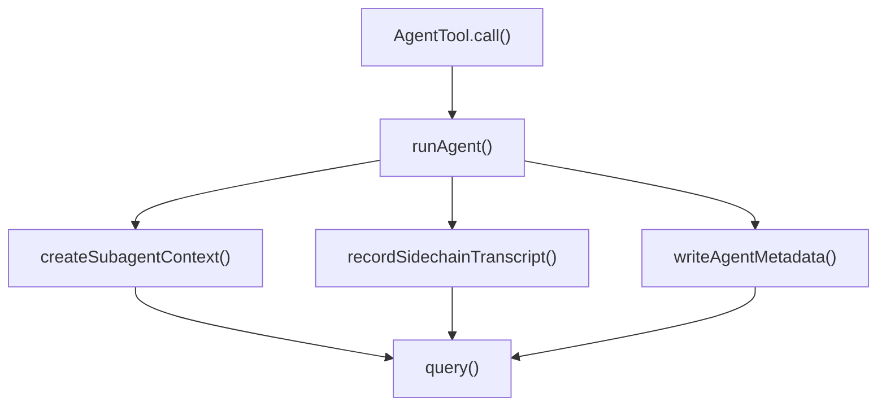
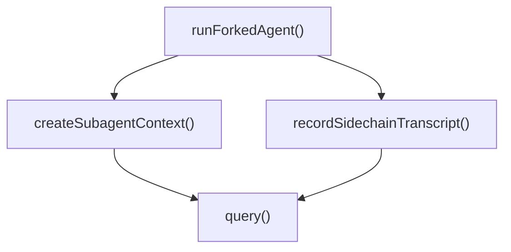
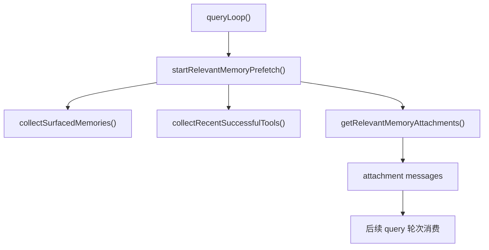
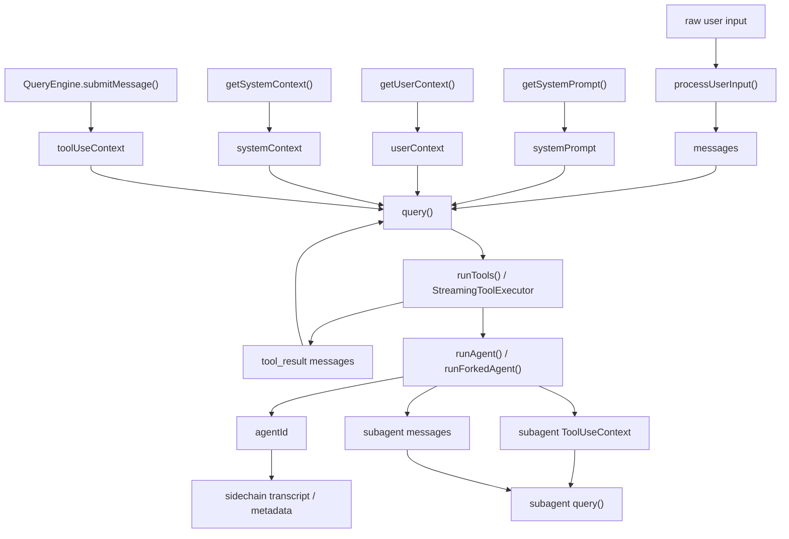
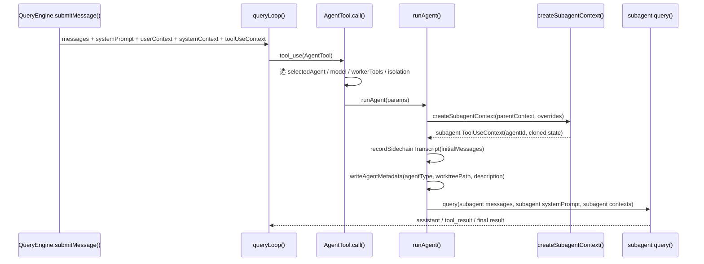

# Claude Code 调用栈地图与参数流转

本文档专门回答两个问题：

1. 从源码函数看，Claude Code 的主流程到底怎么一层层调用下去
2. 在这些函数之间，`messages`、`systemPrompt`、`userContext`、`systemContext`、`toolUseContext`、`agentId` 这些核心对象是怎么流转的

这篇文档不再按“系统概念”讲，而是按**函数调用链 + 参数流**来讲。

如果用一句话概括：

**Claude Code 的运行时本质上是一个递归 Agent 循环：主线程把输入装配成 `query()`，`query()` 再驱动 tool runtime，必要时继续派生新的 `query()`。**

---

## 1. 先看总图

这张图最重要的结论是：

- 主线程不是一次性把问题问完
- `query()` 不是一次性 API 调用
- 工具执行不是旁路逻辑
- 子 Agent 不是独立系统，而是递归进入同一套 `query()` 机制

---

## 2. 怎么读这篇文档

推荐顺序：

1. 先看 `第 3~7 节`
   先建立函数调用链
2. 再看 `第 8~10 节`
   理解几个核心参数对象怎么流
3. 最后看 `第 11 节`
   用一次真实委托把函数和参数串起来

---

## 3. 主线程入口调用栈

用户发来一句话后，主线程最核心的一条调用链是：

按源码阅读顺序展开，大致是：

1. `QueryEngine.submitMessage()`
2. `fetchSystemPromptParts()`
3. `getSystemPrompt()` / `getUserContext()` / `getSystemContext()`
4. `processUserInput()`
5. `recordTranscript()`
6. `query()`

### 3.1 每个函数在做什么

| 函数 | 作用 |
|------|------|
| `QueryEngine.submitMessage()` | 会话级入口，准备本轮运行参数和上下文 |
| `fetchSystemPromptParts()` | 并行构造 `defaultSystemPrompt`、`userContext`、`systemContext` |
| `processUserInput()` | 把原始输入转换成系统真正消费的消息、附件、slash command 结果 |
| `recordTranscript()` | 在进主循环前先落盘，保证恢复能力 |
| `query()` | 进入真正的模型决策循环 |

### 3.2 这一层最关键的工程点

- 先构造运行环境，再进入模型
- 用户输入不是直接送模型，而是先过本地解释层
- transcript 先写盘，再发请求

---

## 4. `query()` 主循环调用栈

`query()` 本身只是入口包装，真正的核心在 `queryLoop()`。

按代码顺序看，核心步骤是：

1. `query()`
2. `queryLoop()`
3. `startRelevantMemoryPrefetch()`
4. `applyToolResultBudget()`
5. `microcompact()`
6. `contextCollapse.applyCollapsesIfNeeded()`
7. `autocompact()`
8. `appendSystemContext()`
9. `prependUserContext()`
10. `deps.callModel()`

### 4.1 这一层真正做了什么

- 把历史消息裁成当前最值得保留的工作集
- 把 `systemPrompt + systemContext` 合成最终 `system`
- 把 `messages + userContext` 合成最终 `messages`
- 在真正发请求前后台启动 memory prefetch

### 4.2 为什么 `query()` 是核心枢纽

因为它同时负责三件事：

1. 上下文整理
2. 模型请求
3. tool result 回灌后的递归继续

所以它不是“模型调用函数”，而是**Agent 运行时主循环**。

---

## 5. assistant 到工具执行的闭环栈

当 `deps.callModel()` 返回 `tool_use` 时，就进入工具运行时。

### 5.1 关键函数关系

| 函数 | 作用 |
|------|------|
| `deps.callModel()` | 返回 assistant text / tool_use / stream event |
| `runTools()` | 非流式路径的工具调度器 |
| `partitionToolCalls()` | 把工具分成可并发批次和串行批次 |
| `runToolsConcurrently()` / `runToolsSerially()` | 按批次执行 |
| `StreamingToolExecutor` | 流式 tool_use 到来时边收边执行 |
| `runToolUse()` | 单个工具的真正执行入口 |

### 5.2 最值得记住的闭环

源码层面的核心闭环其实就是：

**`callModel -> tool_use -> runToolUse -> tool_result -> callModel`**

Claude Code 的“会用工具”能力，本质上就是这个闭环不断重复。

---

## 6. 普通子 Agent 调用栈

当主线程决定把工作委托给子 Agent 时，会进入 `AgentTool` 分支。

继续展开后，关键顺序是：

1. `AgentTool.call()`
2. 选中 `selectedAgent`
3. 计算模型、权限、工具池、隔离方式
4. `runAgent()`
5. `createSubagentContext()`
6. `recordSidechainTranscript()`
7. `writeAgentMetadata()`
8. 子 Agent 进入自己的 `query()`

### 6.1 这条链说明什么

- 子 Agent 不是简单函数调用
- 它会拥有自己的 `ToolUseContext`
- 它会拥有自己的 transcript / metadata
- 它会重新跑一套独立的 `query()`

所以普通子 Agent 本质上是：

**“新上下文 + 新消息窗口 + 同一套主循环”的一次递归调用。**

---

## 7. fork agent 与相关记忆预取

### 7.1 fork agent

fork agent 的入口更轻，重点是保住父前缀。

顺序是：

1. `runForkedAgent()`
2. 读取 `cacheSafeParams`
3. `createSubagentContext()`
4. 拼 `initialMessages = forkContextMessages + promptMessages`
5. `recordSidechainTranscript()`
6. 调 `query()`

fork agent 的关键不是新链路，而是：

- system prefix 尽量不变
- tools 尽量不变
- user/system context 尽量不变
- 只新增一小段尾部 prompt

### 7.2 relevant memory 预取

相关记忆召回有一条独立的后台链：

这说明 relevant memory 不是固定前缀，而是：

- 根据当前 turn 触发
- 后台预取
- 以后续 attachment 形式并入消息流

---

## 8. 参数流转总览

从代码上看，最关键的 6 个对象是：

- `messages`
- `systemPrompt`
- `userContext`
- `systemContext`
- `toolUseContext`
- `agentId`

它们的关系可以先看一张图：

---

## 9. 六个核心对象怎么流

### 9.1 `messages`

| 阶段 | 函数 | 发生什么 |
|------|------|------|
| 创建 | `processUserInput()` | 把原始输入变成 user message / attachment message / hook context |
| 落盘 | `recordTranscript()` | 主线程在进 `query()` 前先写盘 |
| 裁剪 | `queryLoop()` | 经过 compact boundary、tool result budget、microcompact、autocompact |
| 发送前合成 | `prependUserContext()` | 在真正调用模型前，把 userContext 作为 meta user message 前置 |
| 回灌 | `runToolUse()` 之后 | `tool_result` 再次进入 `messages` |
| 子线程派生 | `runAgent()` / `runForkedAgent()` | 子 Agent 拿到自己的 `initialMessages` |

最重要的理解是：

**`messages` 不是静态历史，而是每一轮都在增长、裁剪、回灌、再发送的工作集。**

### 9.2 `systemPrompt`

| 阶段 | 函数 | 发生什么 |
|------|------|------|
| 创建 | `fetchSystemPromptParts()` | 先拿到 `defaultSystemPrompt` |
| 组装 | `QueryEngine.submitMessage()` | 加上 custom prompt、memory mechanics、append prompt |
| 最终合成 | `appendSystemContext()` | 把 `systemContext` 追加进去 |
| 子 Agent 重建 | `runAgent()` | 按 AgentDefinition 重建 agent-specific system prompt |
| fork 复用 | `runForkedAgent()` | 尽量直接复用父前缀 |

所以：

- 主线程更像“组装”
- 普通子 Agent 更像“重建”
- fork agent 更像“复用”

### 9.3 `userContext`

| 阶段 | 函数 | 发生什么 |
|------|------|------|
| 创建 | `getUserContext()` | 读取 CLAUDE.md、rules、日期等 |
| 进入主流程 | `fetchSystemPromptParts()` | 作为 cache-safe prefix 的一部分返回 |
| 真正发送 | `prependUserContext()` | 变成 `messages` 开头的 meta user message |
| 子 Agent 裁剪 | `runAgent()` | Explore / Plan 等可省略部分字段 |
| fork 复用 | `runForkedAgent()` | 尽量沿用父值不变 |

### 9.4 `systemContext`

| 阶段 | 函数 | 发生什么 |
|------|------|------|
| 创建 | `getSystemContext()` | 读取 gitStatus 等环境快照 |
| 进入主流程 | `fetchSystemPromptParts()` | 作为 prefix 一部分返回 |
| 真正发送 | `appendSystemContext()` | 拼到最终 `system` 尾部 |
| 子 Agent 裁剪 | `runAgent()` | 只读型 Agent 可去掉 `gitStatus` |
| fork 复用 | `runForkedAgent()` | 尽量不变 |

### 9.5 `toolUseContext`

这是整个运行时里最重要的“执行上下文对象”。

它承载的不只是 tools，还包括：

- `options.tools`
- `options.mainLoopModel`
- `abortController`
- `readFileState`
- `getAppState()` / `setAppState()`
- `messages`
- `agentId`
- `agentType`
- `contentReplacementState`

| 阶段 | 函数 | 发生什么 |
|------|------|------|
| 创建 | `QueryEngine.submitMessage()` | 主线程组装第一版 `processUserInputContext` |
| 进入 query | `query()` | 作为 `QueryParams.toolUseContext` 进入 |
| 每轮更新 | `queryLoop()` | `toolUseContext.messages = messagesForQuery` |
| 子 Agent 派生 | `createSubagentContext()` | 默认克隆可变状态、隔离 UI、生成新 `agentId` |
| fork 共享策略 | `createSubagentContext()` | 克隆 contentReplacementState 以保持 cache-safe 决策一致 |

所以可以把 `toolUseContext` 理解成：

**Agent 线程的运行时栈帧。**

### 9.6 `agentId`

| 场景 | 函数 | 作用 |
|------|------|------|
| 普通子 Agent | `runAgent()` | 创建子线程身份 |
| fork agent | `runForkedAgent()` | 创建 sidechain 身份 |
| sidechain 落盘 | `recordSidechainTranscript()` | 作为 transcript 子链 key |
| metadata 落盘 | `writeAgentMetadata()` | 作为 `.meta.json` 对应键 |
| ToolUseContext | `createSubagentContext()` | 写进 `toolUseContext.agentId` |
| 恢复 | `resumeAgentBackground()` | 根据 `agentId` 找 transcript / metadata |

所以 `agentId` 的本质不是“显示名字”，而是：

**跨 query、跨 transcript、跨 resume 的执行线程身份。**

---

## 10. 三组最容易混淆的参数

### 10.1 `messages` vs `userContext`

- `messages` 是工作消息流
- `userContext` 是会在发送前被包装成 meta message 的上下文块

### 10.2 `systemPrompt` vs `systemContext`

- `systemPrompt` 是系统规则主体
- `systemContext` 是会在最后拼进去的环境快照

### 10.3 `ToolUseContext` vs `QueryParams`

- `QueryParams` 是一次 `query()` 调用的参数包
- `ToolUseContext` 是 query 内部和 tool runtime 共享的执行上下文

可以简单记成：

- `QueryParams` 更像函数入参
- `ToolUseContext` 更像线程上下文

---

## 11. 一次普通子 Agent 委托的完整参数流

这一段把“函数调用”和“参数流转”合起来看。

这一整段最关键的结论是：

- 主线程没有把自己“借给”子 Agent
- 而是重新派生出一个新的 `ToolUseContext + messages + agentId`
- 然后再把这套对象重新送进 `query()`

也就是说，子 Agent 的本质不是 callback，而是：

**一次带独立运行时上下文的递归 query 调用。**

---

## 12. 关键源码入口索引

| 主题 | 关键函数 / 文件 |
|------|------|
| 主线程入口 | `src/QueryEngine.ts` -> `submitMessage()` |
| prefix 装配 | `src/utils/queryContext.ts` -> `fetchSystemPromptParts()` |
| 输入处理 | `src/utils/processUserInput/processUserInput.ts` -> `processUserInput()` |
| 主循环 | `src/query.ts` -> `query()` / `queryLoop()` |
| 工具调度 | `src/services/tools/toolOrchestration.ts` -> `runTools()` |
| 流式工具执行 | `src/services/tools/StreamingToolExecutor.ts` |
| 单工具执行 | `src/services/tools/toolExecution.ts` -> `runToolUse()` |
| 子 Agent 上下文 | `src/utils/forkedAgent.ts` -> `createSubagentContext()` |
| fork agent | `src/utils/forkedAgent.ts` -> `runForkedAgent()` |
| 普通子 Agent | `src/tools/AgentTool/runAgent.ts` -> `runAgent()` |
| 相关记忆预取 | `src/utils/attachments.ts` -> `startRelevantMemoryPrefetch()` |
| sidechain transcript | `src/utils/sessionStorage.ts` -> `recordSidechainTranscript()` |
| agent metadata | `src/utils/sessionStorage.ts` -> `writeAgentMetadata()` |

---

## 13. 最后的结论

如果从源码函数层面重新概括 Claude Code，可以把它理解成：

**一个把“上下文装配、模型调用、工具执行、子 Agent 派生”统一收敛到 `query()` 递归循环里的 Agent 运行时。**

这套运行时最关键的不是某一个函数，而是下面这组组合关系：

- `submitMessage()` 负责把输入装配成可执行 turn
- `queryLoop()` 负责把 turn 推进成 agentic loop
- `runToolUse()` 负责把模型决策变成真实副作用
- `createSubagentContext()` 负责把主线程递归派生成新的执行线程
- `agentId + sidechain transcript + metadata` 负责让这些线程可恢复、可追踪

所以，真正的“主调用栈”并不是线性的一条线，而是：

**主线程调用栈 + 工具执行闭环 + 子 Agent 递归调用栈** 的组合。 
