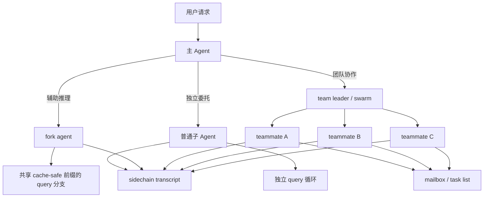

# Claude Code 子 Agent 系统技术方案

本文档专门解释 Claude Code 里的子 Agent / fork agent / teammate / swarm 体系。目标不是解释某几个实现文件，而是回答下面这些问题：

- 为什么需要子 Agent，而不是一个主 Agent 干到底
- 子 Agent 和 fork agent 有什么本质区别
- teammate / swarm 又和普通子 Agent 有什么不同
- 它们如何隔离状态、共享上下文、处理权限、并行推进
- 为什么系统要同时保留多种执行单元

如果用一句话概括：

**Claude Code 的子 Agent 系统，本质上是一个多层执行模型：主线程负责统一对外，fork agent 负责低成本派生推理，子 Agent 负责独立委托执行，teammate / swarm 负责多实体协作。**

---

## 1. 设计目标

这套子 Agent 系统主要在解决 5 类问题：

1. **上下文过大**  
   一个主 Agent 把所有子问题都吃进去，上下文会越来越重。

2. **任务天然可以分治**  
   搜索、分析、实现、验证经常可以拆开并行做。

3. **不同子问题需要不同权限和工具集**  
   读代码的 Agent 和写代码的 Agent，不应该总是共享同一权限面。

4. **有些子任务只是“辅助推理”**  
   比如摘要、session memory、旁路分析，不值得起一个重型独立 worker。

5. **有些任务需要真正协作**  
   不只是“帮我算一下”，而是多个执行体长期存在、互相发消息、领取任务。

所以 Claude Code 不是只有一个“subagent”概念，而是拆成多层执行单元。

---

## 2. 三层执行模型

从技术方案上，可以把 Claude Code 的多执行体模型拆成三层。

### 2.1 主 Agent

主 Agent 就是当前与用户直接交互的会话主线程。

它负责：

- 接收用户请求
- 决定是否调用工具
- 决定是否拆子任务
- 汇总结果并对用户输出

它是系统的总控面。

### 2.2 派生 Agent

派生 Agent 是主 Agent 创建出来的执行单元，主要分两类：

- **fork agent**
- **普通子 Agent**

两者都来自主线程，但目标不同：

- fork agent：偏便宜、偏短期、偏 cache-friendly
- 普通子 Agent：偏独立、偏委托、偏角色化

### 2.3 协作 Agent

协作 Agent 指 teammate / swarm 体系中的执行单元。

它们和普通子 Agent 的最大区别是：

- 不只是一次性委托
- 而是能作为团队成员长期存在
- 可以通过 mailbox / task list 协作
- 可以持续领取任务、汇报进展、接受 leader 控制

---

## 3. 为什么不能只有一个主 Agent

如果只有主 Agent，会遇到几个非常具体的工程问题：

### 3.1 上下文污染

一个任务里同时做：

- 代码库探索
- 方案分析
- 编码修改
- 测试验证
- 文档输出

会让消息历史迅速膨胀。

### 3.2 串行过慢

本来可以并行的事情，被一个主线程串起来做，延迟会很高。

### 3.3 权限边界不清晰

如果所有能力都放在主线程里，很难做到：

- 某个子问题只读
- 某个子问题只能用特定工具
- 某个后台 Agent 不打扰用户

### 3.4 难以形成角色化协作

搜索 Agent、实现 Agent、验证 Agent 的工作方式本来就不同。全塞进一个主体，系统行为会很混。

所以子 Agent 不是“锦上添花”，而是控制复杂度的核心机制。

---

## 4. 普通子 Agent 的定义

在 Claude Code 里，普通子 Agent 可以理解为：

**由主 Agent 发起、拥有独立上下文和执行循环的委托工作单元。**

它通常具备以下特征：

- 有自己的 `agentId`
- 有自己的 `query()` 循环
- 有自己的 transcript / metadata
- 可拥有独立工具集合
- 可拥有独立权限模式
- 默认与主线程状态隔离

这意味着子 Agent 不是简单函数调用，而是一个**轻量独立会话**。

---

## 5. 普通子 Agent 的启动链路

从方案上看，普通子 Agent 的启动大致分为 8 步：

1. 主 Agent 决定调用 Agent 工具
2. 选定 `AgentDefinition`
3. 计算模型、权限模式、工具范围
4. 构造 prompt messages
5. 决定是否继承父上下文消息
6. 构造新的 `ToolUseContext`
7. 写 sidechain transcript / metadata
8. 启动独立 `query()` 循环

其中最关键的点有三个：

- **不是盲目继承主线程上下文**
- **不是盲目继承主线程权限**
- **不是盲目共享主线程状态**

这三个“不盲目”构成了整个子 Agent 方案的核心。

---

## 6. 子 Agent 的上下文继承策略

普通子 Agent 不会把父上下文原封不动拷进去，而是做“选择性继承”。

### 6.1 会继承什么

通常会继承：

- 必要的父消息上下文
- 主线程已有的用户/系统 context 基础信息
- 工具定义池
- 一些缓存相关信息

### 6.2 会裁剪什么

系统会主动裁剪一些高成本但对特定 Agent 没价值的内容，例如：

- 对 Explore / Plan 这类只读搜索 Agent，可能省略 `claudeMd`
- 对 Explore / Plan，还可能省略主线程启动时注入的 `gitStatus`

这体现出明确的策略：

**子 Agent 不是越“全量继承”越好，而是越“符合职责”越好。**

### 6.3 为什么要裁剪

因为 Claude Code 把子 Agent 当作“角色化执行单元”，不是主线程的完整复制品。

所以裁剪是必要的：

- 减少 token 成本
- 降低无关上下文干扰
- 提高角色聚焦度

---

## 7. 子 Agent 的状态隔离模型

Claude Code 的子 Agent 隔离策略可以概括成一句话：

**默认隔离，按需共享。**

这是通过 `createSubagentContext` 体现出来的。

### 7.1 默认隔离的内容

默认会隔离的通常包括：

- `readFileState`
- `nestedMemoryAttachmentTriggers`
- `loadedNestedMemoryPaths`
- `dynamicSkillDirTriggers`
- `discoveredSkillNames`
- `toolDecisions`
- 大部分 UI 回调

这说明系统把子 Agent 视为**独立执行现场**，而不是主线程内部的一个回调。

### 7.2 默认不共享 `setAppState`

异步子 Agent 默认不会直接共享主线程的 `setAppState`，而是变成 no-op。

这么做是为了避免：

- 后台 Agent 污染主线程 UI 状态
- 多个 Agent 并发修改同一全局状态导致混乱

### 7.3 为什么还保留 `setAppStateForTasks`

虽然默认不共享 `setAppState`，但任务注册与 kill 仍然要能到达 root store。

这说明系统做了细粒度划分：

- 普通 UI/会话状态默认隔离
- 会影响后台生死管理的状态必须能回到根状态树

这是一种非常工程化的隔离设计。

---

## 8. 子 Agent 的权限模型

子 Agent 的权限不是主线程权限的无脑复制。

### 8.1 权限模式可覆盖

Agent 定义可以指定自己的 permission mode。

但主线程若已经处于某些更强控制模式，例如：

- `bypassPermissions`
- `acceptEdits`

则会优先以主线程为准。

### 8.2 异步 Agent 默认避免打扰用户

异步 Agent 往往不能直接弹权限框，因此系统会把它们标记为：

- `shouldAvoidPermissionPrompts`

这意味着：

- 尽量自动决策
- 不要轻易打断用户

### 8.3 background agent 的特殊处理

如果某些后台 Agent 允许弹框，系统也会先等待自动检查完成，再决定是否真的打扰用户。

这说明它把权限设计成：

**用户体验优先 + 自动化优先 + 高风险才升级交互。**

---

## 9. 工具范围控制

子 Agent 不一定使用主线程的完整工具面。

### 9.1 为什么要限制工具

原因非常直接：

- 搜索型 Agent 不需要写文件
- 验证型 Agent 不一定需要全量 Shell
- 某些 Agent 只该访问特定 MCP

### 9.2 限制方式

系统可以：

- 从 `AgentDefinition` 推导工具集
- 通过 `allowedTools` 覆盖 session 级允许规则
- 为 Agent 追加专属 MCP tools

### 9.3 这说明什么

Claude Code 的 Agent 不是“一个模型 + 全部工具”，而是：

**一个角色定义 + 一组受控能力面。**

---

## 10. Transcript 与元数据策略

普通子 Agent 会有自己的 sidechain transcript 和 metadata。

### 10.1 为什么不全写回主 transcript

如果所有子 Agent 消息都直接混进主会话，会造成：

- 历史过于嘈杂
- 用户视角难以阅读
- 恢复逻辑变复杂

所以系统采用 sidechain transcript：

- 子 Agent 自己记自己的过程
- 主线程只消费必要结果

### 10.2 metadata 有什么用

Agent metadata 一般会记录：

- agent type
- worktree path
- description

这些数据主要服务于：

- resume
- 状态展示
- 后续路由

所以子 Agent 不只是“跑一下”，而是一个可追踪、可恢复的执行体。

---

## 11. fork agent 的定义

fork agent 也是派生出来的，但它的目标和普通子 Agent 不同。

可以把 fork agent 理解为：

**主线程为某个辅助推理任务创建的轻量推理分支，它高度强调 prompt cache 共享。**

它适合做的事包括：

- session memory
- 摘要生成
- 旁路判断
- 补充分析

它不追求长期自治，而追求：

- 便宜
- 快
- 尽量复用父请求前缀

---

## 12. fork agent 为什么存在

如果不用 fork agent，有两个极端：

### 12.1 全都在主线程做

问题是：

- 主线程上下文更重
- 主任务被辅助工作拖慢
- 很难把“探索性推理”和“主线工作”分开

### 12.2 全都起普通子 Agent

问题是：

- 太重
- 开销高
- 很多小型辅助任务不值得
- prompt cache 利用率差

所以 fork agent 正好填补中间地带：

**它是“比主线程独立一点、比普通子 Agent 轻很多”的辅助执行单元。**

---

## 13. fork agent 的核心方案

fork agent 的关键在于 `cacheSafeParams`。

### 13.1 它想解决什么

模型请求的 cache key 依赖于：

- system prompt
- user context
- system context
- tools
- messages prefix

如果这些前缀在 fork 时发生变化，就会失去缓存收益。

### 13.2 它怎么做

所以 fork agent 不重新“自由构造”这些内容，而是尽量沿用主线程已经稳定下来的 prefix 参数。

这意味着 fork agent 的重点不是高度自定义，而是：

**保持与父线程的前缀一致性。**

### 13.3 为什么这很重要

因为很多 fork 任务只是辅助分析，如果每次都重新消耗完整前缀成本，收益会大打折扣。

所以从技术取舍上，fork agent 的第一原则是：

**共享缓存优先。**

---

## 14. fork agent 与普通子 Agent 的本质区别

两者最核心的区别不是“谁更像 Agent”，而是优化目标不同。

| 维度 | 普通子 Agent | fork agent |
|------|------|------|
| 主要目标 | 独立委托执行 | 低成本辅助推理 |
| 定制度 | 高 | 低到中 |
| prompt cache 重要性 | 有价值，但不是第一优先 | 第一优先 |
| 生命周期 | 可较长 | 通常较短 |
| transcript | 通常有独立 sidechain | 可有 sidechain，但更轻 |
| 工具与权限 | 可明显定制 | 常更贴近父线程 |
| 典型工作 | 搜索、实现、验证、角色化执行 | session memory、摘要、分支分析 |

所以：

- 普通子 Agent 更像“派出去做事的人”
- fork agent 更像“主线程临时分出的一个脑内分支”

---

## 15. teammate / swarm 的定义

teammate / swarm 是第三层执行模型，它们不再只是主线程的一个派生分支，而是**团队协作执行体**。

可以把 teammate 理解为：

**加入某个 team 的独立成员，拥有身份、消息收件箱、任务领取能力和持续运行能力。**

这和普通子 Agent 最大的差异在于：

- 子 Agent 更像“一次委托”
- teammate 更像“持续在线的协作者”

---

## 16. teammate 的身份模型

teammate 不只是一个 agentId，它还有团队语义。

典型身份维度包括：

- `agentId`
- `agentName`
- `teamName`
- `color`
- `parentSessionId`
- `planModeRequired`

这意味着它不只是执行器，还是一个团队中的成员。

这种身份模型带来几个好处：

- 可以区分 leader 和不同 teammate
- 可以让 UI 做团队展示
- 可以做 mailbox 路由
- 可以让 transcript 形成团队关联

---

## 17. teammate 的通信方案

普通子 Agent 和主线程通常是直接调用关系，而 teammate 之间更接近异步协作。

Claude Code 这里采用的是：

**基于文件系统的 mailbox 通信。**

### 17.1 mailbox 是什么

每个 teammate 都有一个 inbox 文件，大致结构是：

- team 维度目录
- agent name 维度 inbox
- JSON 消息数组

### 17.2 为什么用 mailbox

因为 swarm 协作需要：

- 异步消息传递
- 多执行体并发写入
- 可落盘、可恢复
- 可在不同运行方式下统一

而 mailbox 文件恰好满足这些条件。

### 17.3 并发怎么保证

mailbox 写入会配合 lockfile，这说明它不是把文件当简单日志，而是把它当**轻量并发消息队列**来使用。

---

## 18. teammate 的上下文模型

对于 in-process teammate，系统还使用了 `AsyncLocalStorage` 保存 `TeammateContext`。

### 18.1 这解决什么问题

如果多个 teammate 在同一进程中并发运行，纯全局变量会互相污染。

而 `AsyncLocalStorage` 可以做到：

- 同进程并发
- 各自持有独立 teammate 身份
- 辅助函数在任意异步链路中都能拿到当前 teammate 上下文

### 18.2 这意味着什么

说明 Claude Code 的 swarm 不是纯“多进程模型”，也支持：

**同进程多执行体并发。**

这也是为什么它要把 teammate identity 设计成多来源解析：

- env vars
- 动态 team context
- AsyncLocalStorage teammate context

---

## 19. in-process teammate 的运行模型

in-process teammate 是很有代表性的一类，因为它体现了“协作 Agent 复用主 Agent 基础设施”的方案。

### 19.1 核心特点

- 它本质上还是调用 `runAgent()`
- 但外层包了一层 teammate 生命周期管理
- 它有持续运行的 while-loop
- 可以反复领取任务、处理 prompt、继续下一轮

### 19.2 为什么这很巧妙

因为它没有重新发明另一套 Agent runtime，而是：

**复用普通子 Agent 的 query 基础设施，再在外层加团队协作控制层。**

这让系统架构更统一：

- 普通子 Agent 用 `runAgent`
- teammate 还是用 `runAgent`
- 差别主要在上下文、循环方式、消息通信和任务管理

### 19.3 为什么 teammate 可以更持久

普通子 Agent 多半是一次委托后结束，而 teammate 可以：

- 继续活着
- 继续接收 leader 消息
- 继续 claim task
- 在多轮之间保留累积消息和替换状态

这使它更接近“worker”。

---

## 20. teammate 与主线程的关系

teammate 不是完全自由的，它和主线程仍有明显层级。

### 20.1 主线程是 leader

主线程通常负责：

- 创建团队
- 下发任务
- 调整 permission mode
- 接收汇报
- 决定 shutdown

### 20.2 teammate 是 worker

teammate 负责：

- 领取任务
- 执行子问题
- 汇报结果
- 接受 leader 控制

所以 swarm 更接近：

**leader-worker 架构**

而不是完全对等的 Agent 社会。

---

## 21. 为什么 teammate 不等于普通子 Agent

虽然两者都调用 `runAgent()`，但它们在系统定位上不同。

### 21.1 普通子 Agent

- 主要解决一次性委托
- 生命周期通常较短
- 通信主要走主线程回传

### 21.2 teammate

- 主要解决持续协作
- 生命周期更长
- 可以通过 mailbox / task list 持续互动

这说明 Claude Code 的团队模型不是单纯靠“多开几个 subagent”实现的，而是有额外协作层。

---

## 22. 并行模型

Claude Code 的子 Agent 系统支持多层次并行。

### 22.1 fork 并行

适合短平快的辅助推理并发。

### 22.2 子 Agent 并行

适合多个独立子任务同时推进，例如：

- 一个搜索
- 一个实现
- 一个验证

### 22.3 teammate 并行

适合更持续的团队协作并发，多个 worker 可同时运行。

### 22.4 为什么分层并行很重要

因为不同任务适合的并发粒度不同：

- 小任务：fork 即可
- 中等任务：普通子 Agent
- 长周期任务：teammate / swarm

这种设计比“一种并行机制打天下”更灵活。

---

## 23. 中断与生命周期控制

子 Agent 系统的另一个难点是：怎么停。

### 23.1 普通子 Agent

普通同步子 Agent 可以共享父 abort controller，父线程中断时一起停。

### 23.2 异步子 Agent

异步子 Agent 可以拥有独立 abort controller，这意味着：

- 父线程当前 turn 结束，不一定杀掉后台 agent
- 它可以继续推进直到完成或被显式终止

### 23.3 in-process teammate

in-process teammate 甚至区分：

- 生命周期 abort
- 当前工作 abort

这样用户按 Escape 时，可以只停当前工作，不必杀掉整个 teammate。

这是一种很成熟的 worker lifecycle 设计。

---

## 24. 为什么要这么强调隔离

多 Agent 系统最容易出的问题就是状态串线。

如果不做隔离，常见风险包括：

- 一个 Agent 的文件读取缓存污染另一个 Agent
- 一个 Agent 的权限状态泄漏到另一个 Agent
- 一个 Agent 的 UI 事件打到主线程
- 多个 Agent 同时写共享状态，导致不可预测行为

Claude Code 的应对方式很明确：

- 默认隔离
- 需要共享的能力显式声明
- 与后台生死有关的状态单独保留通道

这说明它的子 Agent 方案本质上是一个：

**受控共享、强隔离的多执行体运行时。**

---

## 25. 为什么要同时保留三种执行单元

这是理解 Claude Code 子 Agent 体系的关键。

### 25.1 如果只有普通子 Agent

会缺少：

- 极轻量辅助推理分支
- 团队级长期协作能力

### 25.2 如果只有 fork agent

会缺少：

- 真正独立的委托执行
- 明显的角色化能力

### 25.3 如果只有 teammate

会过重：

- 很多辅助任务不值得进 swarm
- 启动和管理成本高

所以最合理的方案不是三选一，而是分层共存：

- **主 Agent**：统一对外
- **fork agent**：便宜的辅助脑分支
- **普通子 Agent**：独立委托执行
- **teammate / swarm**：长期协作 worker

---

## 26. 一张总览图

---

## 27. 三种执行单元对比表

| 维度 | fork agent | 普通子 Agent | teammate / swarm |
|------|------|------|------|
| 主要目标 | 辅助推理 | 独立委托执行 | 多成员协作 |
| 生命周期 | 短 | 中到长 | 长 |
| prompt cache 优先级 | 很高 | 中 | 视场景而定 |
| 是否强调角色化 | 低 | 高 | 高 |
| 是否长期存在 | 通常否 | 视任务而定 | 通常是 |
| 是否有团队身份 | 否 | 否 | 是 |
| 通信方式 | 回传主线程 | 回传主线程 | mailbox / task / leader 控制 |
| 状态隔离 | 强 | 强 | 强，但带协作层 |
| 典型用途 | 摘要、session memory、旁路分析 | 搜索、实现、验证 | 分布式协作、持续 worker |

---

## 28. 目录结构与落盘信息

如果你关心“不同 Agent 到底把信息存在哪”，可以把 Claude Code 的运行时存储分成 4 类。

### 28.1 普通子 Agent / fork agent 的 sidechain

这类 Agent 的执行过程不会直接混进主 transcript，而是写到会话目录下的 sidechain 文件。

典型结构是：

- `<project-session-dir>/<sessionId>/subagents/agent-<agentId>.jsonl`
- 如果调用方传了 `transcriptSubdir`，则会变成：
- `<project-session-dir>/<sessionId>/subagents/<subdir>/agent-<agentId>.jsonl`

它旁边还会有一个 sidecar metadata：

- `<project-session-dir>/<sessionId>/subagents/agent-<agentId>.meta.json`

这个 metadata 当前主要记录：

- `agentType`
- `worktreePath`
- `description`

所以普通子 Agent 的核心持久化是：

- 过程消息在 `.jsonl`
- 恢复路由信息在 `.meta.json`

### 28.2 remote agent 的本地持久化

如果 Agent 不是本地 sidechain，而是 remote/CCR 任务，本地不会保存完整执行 transcript，而是保存一份可恢复身份信息：

- `<project-session-dir>/<sessionId>/remote-agents/remote-agent-<taskId>.meta.json`

这份 metadata 主要记录：

- `taskId`
- `remoteTaskType`
- `sessionId`
- `title`
- `command`
- `spawnedAt`
- `toolUseId`
- 若干 `remoteTaskMetadata`

也就是说，remote agent 的恢复依赖的是：

- 本地保存“它是谁”
- 远端再查询“它现在怎么样”

### 28.3 teammate / swarm 的团队目录

协作型 Agent 不只是一个 sidechain 文件，它还有一整套 team 目录。

最核心的目录是：

- `~/.claude/teams/<team-name>/config.json`
- `~/.claude/teams/<team-name>/inboxes/<agent-name>.json`

其中：

- `config.json` 是团队配置和成员名册
- `inboxes/*.json` 是每个 teammate 的收件箱

`config.json` 里会保存的典型成员信息包括：

- `agentId`
- `name`
- `agentType`
- `model`
- `prompt`
- `color`
- `planModeRequired`
- `joinedAt`
- `tmuxPaneId`
- `cwd`
- `worktreePath`
- `sessionId`
- `subscriptions`
- `backendType`
- `isActive`
- `mode`

所以 teammate 的“Agent 信息存储”比普通子 Agent 更重，因为它不仅要恢复执行，还要恢复：

- 团队成员身份
- 当前权限模式
- pane / session 绑定
- mailbox 路由

### 28.4 Agent 自己的长期 memory

如果某个 AgentDefinition 开启了 `memory`，它还会有独立长期记忆目录。这和 sidechain transcript 不是一回事。

按 scope 不同，目录分别是：

- `user`: `<memoryBase>/agent-memory/<agentType>/`
- `project`: `<cwd>/.claude/agent-memory/<agentType>/`
- `local`: `<cwd>/.claude/agent-memory-local/<agentType>/`

这里面通常也是 `MEMORY.md + topic files` 的结构。

所以要区分两类“Agent 信息”：

- sidechain / team config：运行时身份与恢复信息
- agent memory：跨任务长期经验

---

## 29. Agent 配置模型

Claude Code 里的 Agent 配置，不是只来自一个地方，而是“定义层 + 调用层”叠加。

### 29.1 定义层：AgentDefinition

系统最终运行的核心对象叫 `AgentDefinition`。

对内建、用户、自定义、插件 Agent 来说，它都会归一成一组共同字段，典型包括：

- `agentType`
- `whenToUse`
- `getSystemPrompt()`
- `tools`
- `disallowedTools`
- `model`
- `effort`
- `permissionMode`
- `maxTurns`
- `skills`
- `mcpServers`
- `hooks`
- `initialPrompt`
- `background`
- `memory`
- `isolation`
- `color`
- `omitClaudeMd`

可以把它理解成：

**Agent 的静态角色定义。**

### 29.2 配置来源

这些定义主要来自 4 类来源：

1. built-in agents  
   直接写在代码里，例如 `Explore`、`Plan`、`generalPurpose`、`verification`

2. markdown agents  
   从 `agents` 子目录加载，来源优先级是：
   `managed (.claude/agents)`、`user (~/.claude/agents)`、`project (<repo>/.claude/agents)` 这一套层叠来源

3. json agents  
   从 settings/json 配置解析成 AgentDefinition

4. plugin agents  
   从插件清单或插件内 agent 文件加载

### 29.3 markdown / json agent 可配什么

自定义 Agent 的 frontmatter / JSON 里，最关键的配置字段大致有：

- `name`
- `description`
- `tools`
- `disallowedTools`
- `model`
- `effort`
- `permissionMode`
- `mcpServers`
- `hooks`
- `maxTurns`
- `skills`
- `initialPrompt`
- `memory`
- `background`
- `isolation`

其中有几个很关键：

- `tools` / `disallowedTools` 决定能力面
- `permissionMode` 决定默认权限模式
- `mcpServers` 决定要不要给这个 Agent 追加专属 MCP
- `memory` 决定它是否有独立持久记忆
- `background` 决定它是否倾向后台运行
- `isolation` 决定它是否默认跑在独立 worktree / remote 环境

### 29.4 plugin agent 的限制

plugin agent 不是完全等价于用户自己写的 `.claude/agents/*.md`。

出于安全边界考虑，plugin agent 的 agent 文件里有几类字段会被忽略：

- `permissionMode`
- `hooks`
- `mcpServers`

也就是说，插件可以提供 agent，但不能靠某个 agent 文件偷偷扩大权限面。

---

## 30. 从调用参数到运行实例

除了静态定义，Agent 真正跑起来前，还会再经过一层“调用期装配”。

### 30.1 AgentTool 输入层

模型调用 `AgentTool` 时，常见输入包括：

- `description`
- `prompt`
- `subagent_type`
- `model`
- `run_in_background`
- `name`
- `team_name`
- `mode`
- `isolation`
- `cwd`

这里面：

- `subagent_type` 决定选哪个 AgentDefinition
- `name + team_name` 会把“普通子 Agent”切到“teammate spawn”路径
- `run_in_background` 决定是否异步
- `isolation` 和 `cwd` 决定工作目录隔离方式

### 30.2 关键覆盖关系

运行时最重要的几条覆盖关系是：

1. `model` 参数优先于 agent definition 的 `model`
2. `isolation` 参数优先于 agent definition 的 `isolation`
3. `run_in_background=true` 会让 Agent 后台运行；如果 definition 里 `background=true`，即使没显式传参也会后台化
4. `cwd` 优先于 worktree 路径，成为该 Agent 的实际工作目录
5. `selectedAgent.permissionMode` 会参与构造 worker 的权限上下文

所以最终实例不是“照着配置文件原样运行”，而是：

**静态 AgentDefinition + 本次调用参数 + 父上下文约束** 三者合成后的结果。

### 30.3 一个更实用的理解方式

可以把不同层分成这样：

- AgentDefinition：这个 Agent “默认是什么人”
- AgentTool 参数：这次“要它怎么出勤”
- metadata / transcript：它“实际跑成了什么样”

这三层加起来，才是 Claude Code 里一个完整的 Agent 实例。

---

## 31. 相关 Prompt 文档

如果你已经理解了运行时模型，下一步最适合配合看的就是 prompt 侧文档：

- [普通子 Agent]({{ site.baseurl }})
  看普通子 Agent 的角色 prompt、上下文裁剪和消息窗口。

- [fork Agent]({{ site.baseurl }})
  看 fork agent 为什么强调 cache-safe 前缀复用。

- [teammate / swarm]({{ site.baseurl }})
  看 teammate / swarm 的协作 addendum 和 team lead 消息结构。

- [请求外壳]({{ site.baseurl }})
  看这些 Agent prompt 最终都落在统一请求结构的哪个位置。

---

## 32. 结论

如果把 Claude Code 的子 Agent 体系抽象成一句更工程化的话，可以这样说：

**它不是“能开子进程”这么简单，而是一个按任务粒度和协作模式分层设计的多执行体 Agent 运行时。**

这套运行时有几个关键特征：

- 主线程统一对外
- fork agent 提供低成本推理分支
- 普通子 Agent 提供独立委托执行
- teammate / swarm 提供长期团队协作
- 默认隔离，按需共享
- 权限、工具、上下文都可按角色裁剪
- transcript、metadata、mailbox、task list 共同支持恢复与协作

所以，Claude Code 的子 Agent 方案本质上是在解决一个更大的问题：

**如何让一个 coding agent 从“单线程对话体”演化成“可分治、可协作、可恢复、可治理的多执行体系统”。**

