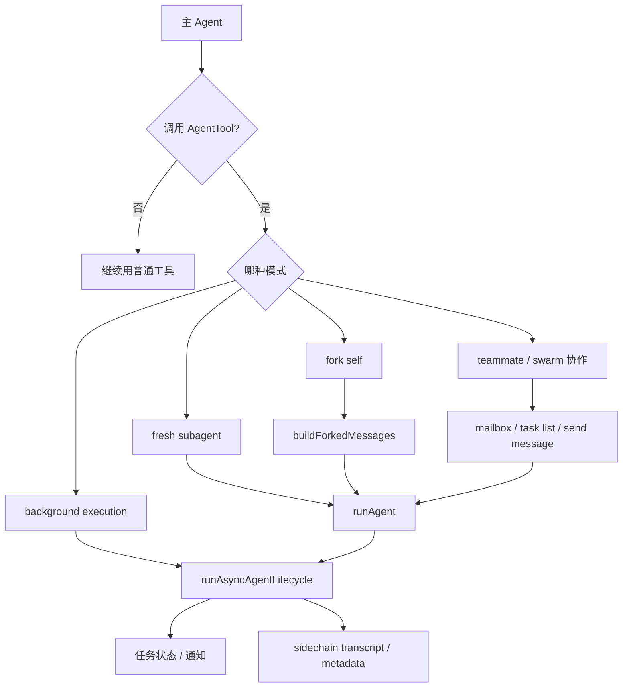

# Claude Code `AgentTool` 深入解析

本文档只聚焦一个工具：`AgentTool`。

之所以值得单独写，是因为它不是普通的“读文件 / 执行命令”工具，而是 Claude Code 整个多执行体体系的入口。很多关键能力都从它分叉出去：

- 子 Agent
- fork agent
- 后台 agent
- resume
- teammate / swarm 协作

如果用一句话概括：

**`AgentTool` 不是单一工具，而是 Claude Code 的委托与多执行体调度入口。**

---

## 1. 它到底是什么

从表面看，`AgentTool` 只是一个“启动 agent”的工具；但从运行时角度看，它承担了 4 个角色：

1. **委托器**  
   把复杂任务交给新的执行单元

2. **分支器**  
   在 fork 模式下，从当前上下文派生新的推理分支

3. **并发入口**  
   允许同一轮中启动多个 agent 并行工作

4. **后台任务入口**  
   允许 agent 脱离当前同步交互，成为被跟踪的异步执行体

所以它不是“另一个工具”，而是系统从单线程转向多线程式行为的关键开关。

---

## 2. 模型看到的 `AgentTool` 是什么样

从 `src/tools/AgentTool/prompt.ts` 来看，模型拿到的不是一句简短描述，而是一整套使用策略。

这个 prompt 主要在做 5 件事：

### 2.1 告诉模型什么时候该用

例如：

- 复杂、多步任务
- 开放式搜索
- 适合分治的工作

### 2.2 告诉模型什么时候不该用

例如：

- 只读一个文件
- 只查少量已知文件
- 简单单步搜索

这一步非常重要，因为它防止模型把所有事情都升级为 agent delegation。

### 2.3 告诉模型怎么写 prompt

它显式区分了两类 prompt：

- **fresh subagent prompt**
- **fork prompt**

这其实是 `AgentTool` 最重要的隐藏知识之一。

### 2.4 告诉模型如何并行

prompt 明确要求：

- 如果用户要求并行
- 应该在一条消息里发多个 `AgentTool` 调用

这说明并行不是 runtime 偷偷做的，而是模型需要主动表达的。

### 2.5 告诉模型如何等待

尤其在 background/fork 场景，它会强调：

- 不要主动 peek
- 不要假设结果
- 不要在结果回来前编造结论

这相当于在 prompt 层给模型打了一层“异步纪律”补丁。

---

## 3. `AgentTool` 的四种主要模式

从系统设计上，可以把 `AgentTool` 触发的执行模式分成四种。

## 3.1 fresh subagent

这是最标准的一种。

特征：

- 指定 `subagent_type`
- 新 agent 有独立角色
- 不完整继承上下文，需要 prompt 补足背景
- 通常更像“派一个新同事去做事”

适合：

- 独立调查
- 专项实现
- 单独验证
- 角色化工作

---

## 3.2 fork self

这是更特殊的一种。

特征：

- 省略 `subagent_type`
- 继承父线程完整上下文
- 目标是 prompt cache 友好
- 更像“我把自己分出一个分支去处理子问题”

适合：

- 辅助研究
- 总结提炼
- 旁路分析
- 不想把中间工具噪音留在主上下文里的子问题

---

## 3.3 background agent

这个维度和前两个是正交的。

也就是说：

- fresh subagent 可以后台跑
- fork 也可以后台跑

特征：

- 不阻塞当前同步交互
- 由任务系统追踪
- 完成后通过通知回流

适合：

- 长时间搜索
- 验证 / 测试
- 大一点的调查任务
- worktree 隔离执行

---

## 3.4 teammate / swarm related agent

这类虽然不一定都由 `AgentTool` 直接触发，但在架构上与 `AgentTool` 深度相连。

特征：

- agent 不只是“一次性委托”，而是团队成员
- 需要 mailbox / task list / leader 协调
- 更像长期 worker

它把 `AgentTool` 的能力从“委托一个 agent”扩展成“组织一组 agent 协作”。

---

## 4. fresh subagent 的完整链路

fresh subagent 是最好理解的一条链。

### 4.1 模型决定委托

模型基于任务复杂度、开放性和分治价值，决定调用 `AgentTool`。

### 4.2 选择 agent type

根据 `subagent_type` 或内置定义，选中 `AgentDefinition`。

### 4.3 构造工具范围

运行时根据：

- agent frontmatter
- allow / deny 工具规则
- MCP 附加工具

构造 agent 可见的能力面。

### 4.4 构造子上下文

通过 `createSubagentContext()` 创建新的 `ToolUseContext`。

这一步会：

- clone `readFileState`
- 新建 nested memory / skill discovery 集合
- 设置 agentId
- 设置新的 query tracking
- 选择性共享少量回调

### 4.5 启动 `query()`

真正执行层还是 `runAgent()` -> `query()`。

也就是说，fresh subagent 并没有一套单独的 LLM 循环，而是复用主系统核心执行引擎。

---

## 5. fork 的完整链路

fork 是 `AgentTool` 里最容易被低估的一条路径。

## 5.1 为什么需要 fork

因为有一类任务具备这些特征：

- 不值得开一个重型 fresh agent
- 但又不想把中间结果全留在主线程上下文
- 希望最大化 prompt cache 复用

这种任务非常适合 fork。

## 5.2 fork 的启用条件

从 `forkSubagent.ts` 来看，fork 模式是有门控的：

- 需要 feature 打开
- coordinator mode 下不启用
- non-interactive session 下不启用

这说明 fork 不是无条件存在，而是特定交互模型下的一种优化路径。

## 5.3 fork 最核心的设计目标

fork 的第一目标不是“更独立”，而是：

**保持与父线程前缀尽可能字节级一致，以共享 prompt cache。**

这就是为什么它会：

- 继承父系统 prompt
- 继承父工具池
- 构造特殊的 placeholder tool_result
- 用 directive 风格 prompt

## 5.4 fork 的 placeholder 机制

`buildForkedMessages()` 是 fork 设计中非常关键的一点。

它会：

- 保留父 assistant message
- 为其中 tool_use 生成统一 placeholder tool_result
- 再拼上子分支自己的 directive 文本

这样做的目的不是“语义更好”，而是：

**让多个 fork child 的前缀尽量一致，从而命中缓存。**

## 5.5 fork child 的纪律

`buildChildMessage()` 里对 fork child 下了非常强的约束，例如：

- 你是 fork，不是主 agent
- 不要再 spawn sub-agent
- 不要聊天
- 直接用工具
- 修改文件就提交
- 最终报告必须结构化

这说明 fork child 不是一个“完整人格 agent”，而是一个：

**严格受控的工作分支执行体。**

---

## 6. 为什么 fork prompt 和 fresh prompt 要分开

这是 `AgentTool` prompt 设计里最重要的一条经验。

### fresh subagent

fresh subagent 没有上下文，所以 prompt 必须补足：

- 任务背景
- 已知结论
- 为什么这件事重要
- 已尝试 / 已排除什么

### fork

fork 已经继承父上下文，所以 prompt 应该是 directive：

- 做什么
- 范围是什么
- 哪些是别的 worker 在做
- 输出要多短

如果把 fresh 的 prompt 写法拿去给 fork，会浪费 token。  
如果把 fork 的 prompt 写法拿去给 fresh，又会信息不足。

所以 `AgentTool` 的 prompt 其实是在教模型：

**子执行单元不是一种，委托方式必须匹配上下文继承模型。**

---

## 7. background agent 的完整链路

后台运行是 `AgentTool` 的第二个大分支。

## 7.1 为什么要后台化

很多 agent 任务都不是立刻给结果最优：

- 测试
- 审计
- 大范围探索
- worktree 中实现

如果全都同步等待，会拖住主线程。

## 7.2 后台化后发生什么

从 `agentToolUtils.ts` 的 `runAsyncAgentLifecycle()` 可以看到，后台 agent 大致会经历：

1. 注册成 task
2. 开始累积 `agentMessages`
3. 持续更新 progress
4. 可选启动 summarization
5. 结束后 `finalize`
6. 转换为 completed / failed / killed
7. 发送通知

这说明后台 agent 不是“放到后台就不管了”，而是正式纳入任务运行时管理。

## 7.3 为什么要 task 化

因为后台 agent 需要：

- 被 UI 显示
- 被用户停止
- 被 resume
- 被通知完成
- 有输出文件

所以 background agent 实际上更像一个被任务系统托管的长生命周期 worker。

## 7.4 partial result 为什么重要

当后台 agent 被 kill 时，系统还会尝试从累计消息中提取 partial result。

这说明它不是把 kill 视为完全失败，而是希望保留：

**已经完成的那部分有效工作。**

---

## 8. resume 的完整链路

`AgentTool` 之所以工程化，不只是因为它能启动 agent，还因为它能 resume。

## 8.1 resume 依赖什么

`resumeAgentBackground()` 依赖几类持久化信息：

- sidechain transcript
- agent metadata
- content replacement records
- 可选 worktree path

这说明 resume 不是“重新问一遍模型”，而是：

**恢复一个已经在运行过的 agent 执行线程。**

## 8.2 resume 做了什么

它会：

- 读取 transcript
- 过滤坏消息和未配对 tool use
- 重建 content replacement state
- 恢复 worktree 路径
- 重新确定 agent type
- 重新构造运行参数
- 重新注册 background task
- 再次进入 async lifecycle

## 8.3 fork resume 的特殊之处

如果 resume 的是 fork agent，系统还要尽量恢复父线程的 rendered system prompt。

原因很明确：

- fork 依赖 prefix 一致性
- resume 后如果重建出的 prompt 前缀变了，会破坏 cache 语义和上下文一致性

所以 fork resume 比普通 resume 更依赖“原始 prompt 字节”的恢复。

---

## 9. `AgentTool` 与任务系统的关系

`AgentTool` 本身是 delegation 入口，但后台化后会深度依赖任务系统。

### 9.1 注册任务

后台 agent 会被注册为 task，以便：

- 统一展示
- 输出落盘
- kill / cleanup
- 状态切换

### 9.2 progress 更新

运行过程中，系统会从 message 流里提取：

- activity
- tool usage
- token / duration 等统计

再写回 task 状态。

### 9.3 最终通知

完成、失败、被 kill 都会变成通知回流给主线程。

这解释了为什么后台 agent 并不是“沉默执行”，而是：

**有完整生命周期管理的可观察执行单元。**

---

## 10. `AgentTool` 与 `SendMessage` / swarm 的关系

表面上看，swarm 更像 `SendMessageTool` 和 mailbox 的地盘；但从架构上，`AgentTool` 和 swarm 其实是连续的。

### 10.1 普通子 Agent

更像一次性委托：

- 你去做
- 做完回来

### 10.2 teammate

更像长期 worker：

- 你持续在线
- 持续接任务
- 用 `SendMessage` 和 team lead 协调

### 10.3 为什么是同一条演化链

因为 in-process teammate 仍然复用 `runAgent()`。

也就是说：

- `AgentTool` 负责打开“多执行体”这扇门
- teammate / swarm 在这之上再叠加团队协作层

所以从架构角度，swarm 不是独立于 `AgentTool` 的另一套世界，而是：

**在 agent 运行时之上增加身份、消息和任务协调。**

---

## 11. `AgentTool` 的几个关键设计取舍

## 11.1 默认隔离，按需共享

子 Agent 默认不共享太多状态，这是为了避免后台执行体污染主线程。

## 11.2 fresh 与 fork 明确区分

不是一个参数小变体，而是两种完全不同的 prompt 语义和缓存策略。

## 11.3 background 进入任务运行时

后台 agent 不是 fire-and-forget，而是进入正式 task lifecycle。

## 11.4 transcript / metadata 必须落盘

否则 resume、通知、恢复、分析都会很脆弱。

## 11.5 prompt 在教模型“怎么委托”

`AgentTool/prompt.ts` 本身就承担了 delegation training 的作用，而不只是工具描述。

---

## 12. 什么时候最应该用 `AgentTool`

最适合的场景通常有三类：

### 12.1 开放式调查

例如：

- “帮我看这个仓库主流程”
- “看看这个分支还有什么没做完”

### 12.2 可独立推进的子任务

例如：

- 一个 agent 搜代码
- 一个 agent 写实现
- 一个 agent 跑验证

### 12.3 不值得把中间噪音放进主上下文的工作

这种情况尤其适合 fork。

---

## 13. 什么时候不要用 `AgentTool`

不适合的场景通常有这些：

- 已知文件直接读
- 明确模式直接 Grep
- 小范围改动直接 Read + Edit
- 简单单步命令直接 Bash

一句话：

**`AgentTool` 适合解决“需要新的执行单元”的问题，不适合替代普通原子工具。**

---

## 14. 一张总览图

---

## 15. 关键源码入口

| 主题 | 路径 |
|------|------|
| 工具 prompt | `src/tools/AgentTool/prompt.ts` |
| 运行 Agent | `src/tools/AgentTool/runAgent.ts` |
| fork 逻辑 | `src/tools/AgentTool/forkSubagent.ts` |
| resume 后台 Agent | `src/tools/AgentTool/resumeAgent.ts` |
| async 生命周期 | `src/tools/AgentTool/agentToolUtils.ts` |
| 子上下文隔离 | `src/utils/forkedAgent.ts` |
| teammate prompt addendum | `src/utils/swarm/teammatePromptAddendum.ts` |
| in-process teammate 运行 | `src/utils/swarm/inProcessRunner.ts` |
| teammate mailbox | `src/utils/teammateMailbox.ts` |

---

## 16. 最后的结论

如果只把 `AgentTool` 看成“启动一个子 agent 的工具”，会低估它在整个系统中的地位。

更准确的理解应该是：

**`AgentTool` 是 Claude Code 从单线程会话转向多执行体运行时的总入口。**

它把几件原本很不同的事情统一到了一个能力面下面：

- 委托
- 分支
- 并行
- 后台化
- 恢复
- 团队协作扩展

所以，理解 Claude Code 的多 Agent 方案，核心不是先看 swarm，而是先把 `AgentTool` 看透。

