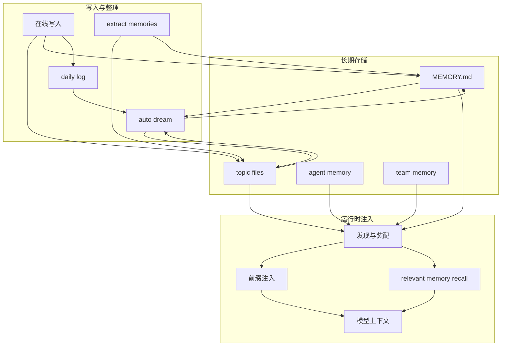

# Claude Code 记忆系统技术方案

本文档重新按“系统设计”视角整理 Claude Code 的 memory 体系。目标不是解释零散函数，而是回答这些核心问题：

- memory 到底解决什么问题
- 它和 transcript、task、plan 的边界是什么
- 它如何存、如何读、如何注入、如何更新
- `daily log`、`extract memories`、`auto dream` 分别处在什么位置
- 它为什么采用文件化、分作用域、按需注入的方案

如果用一句话概括：

**Claude Code 的 memory 不是聊天历史，也不是黑盒召回库，而是一个文件化、分作用域、受预算约束、可维护的长期上下文系统。**

---

## 1. 先给结论

从架构上看，Claude Code 的 memory 系统有 4 个最重要的判断：

1. **memory 是长期知识，不是当前会话状态。**
2. **memory 以文件系统为底座，而不是优先依赖向量库。**
3. **memory 不是每轮全量注入，而是前缀注入和按需检索并存。**
4. **memory 不只是“写入”，还包括提取、整理、蒸馏、纠错和索引维护。**

---

## 2. memory 的边界

理解 Claude Code 的 memory，第一步不是看存储，而是先看边界。

### 2.1 它不等于 transcript

- `transcript` 解决的是：会话过程如何记录、恢复、回放
- `memory` 解决的是：哪些信息值得跨会话保留下来

因此：

- transcript 更像历史流水
- memory 更像长期知识库

### 2.2 它不等于 task

- `task` 保存当前这次工作的拆解、进度、owner、依赖
- `memory` 保存未来仍然有价值的偏好、背景、经验、约束

因此：

- task 偏当前执行
- memory 偏长期协作

### 2.3 它不等于 plan

- `plan` 保存当前非平凡任务的实施方案
- `memory` 保存跨任务仍然成立的背景和偏好

因此：

- plan 偏当前方案
- memory 偏长期知识

### 2.4 它不等于代码库本身

Claude Code 明确不鼓励把“能从代码直接推导出来的事实”写进 memory。

适合写 memory 的通常是：

- 用户偏好
- 项目背景
- 决策理由
- 外部系统入口
- 协作经验
- 不能从仓库内容直接推出的上下文

---

## 3. 设计目标

这套 memory 系统主要在解决 6 个问题：

1. **跨会话保留知识**
2. **让记忆可见、可审计、可删除**
3. **避免长期上下文污染**
4. **支持多作用域和多 Agent**
5. **复用现有工具链，不引入重型新基础设施**
6. **让长期知识可以持续维护，而不是越积越乱**

---

## 4. 系统总览

从系统设计上，可以把 Claude Code 的 memory 体系拆成 6 层。

### 4.1 存储层

真正保存内容的地方，例如：

- `MEMORY.md`
- topic files
- user memory
- project memory
- local memory
- agent memory
- team memory
- daily logs

### 4.2 发现层

负责发现当前有哪些 memory 文件应进入上下文，例如：

- CLAUDE.md
- `.claude/CLAUDE.md`
- `.claude/rules/*.md`
- user/global memory
- auto memory
- include 进来的 memory 文件

### 4.3 注入层

负责把 memory 送进模型，主要有两条路径：

- 前缀注入
- 按需 recall

### 4.4 在线更新层

负责在当前会话内直接写 memory。

### 4.5 增量提取层

负责从最近消息中提取应该沉淀的 memory。

### 4.6 整理蒸馏层

负责回看日志、既有 memory、必要时 transcript，对 memory 做 consolidation。

---

## 5. 为什么采用文件化方案

Claude Code 没有把 memory 优先设计成数据库或 embedding store，而是大量使用文件系统。

这不是偶然，而是 coding agent 场景下的明确取舍。

### 5.1 可见

memory 是文件，意味着：

- 用户能看
- Agent 能读
- 工具能改
- 出错时容易追查

### 5.2 可迁移

复制目录即可迁移，不依赖独占服务。

### 5.3 可组合

memory 可以直接复用现有操作面：

- Read
- Edit
- Write
- Grep
- Glob
- Git

### 5.4 可维护

文件化 memory 更容易支持：

- 更新
- 删除
- 去重
- 索引维护
- 人工修正

所以从技术取舍上，它优先的是：

**透明、稳定、易治理**

而不是：

**黑盒智能度最大化**

---

## 6. 存储模型

### 6.1 `MEMORY.md`

`MEMORY.md` 是高频入口文件，但它不是正文仓库，而是索引。

它负责：

- 告诉模型当前 memory 目录里有哪些长期主题
- 给每个 topic 一个简短钩子
- 让模型快速建立全局地图

它不应该承载：

- 大段正文
- 全量历史
- 详细推理过程

### 6.2 topic files

topic files 是具体 memory 内容的承载体。

它们适合保存：

- 用户偏好主题
- 项目背景主题
- 协作反馈主题
- 外部系统参考主题

### 6.3 daily logs

在长时间运行的 assistant 场景中，系统允许先把新信号 append 到按日命名的日志里，再由后续机制整理。

这类存储更偏：

- 先快写
- 后整理

### 6.4 agent memory

某些 Agent 类型可以有自己的 memory 目录。

这意味着系统允许：

- 主线程有自己的长期记忆
- specialized agent 也有自己的长期记忆面

### 6.5 team memory

在团队协作模式下，还会存在 team 级共享记忆。

这使整个 memory 空间不再是单一命名空间，而是多作用域体系。

---

## 7. 作用域模型

Claude Code 的 memory 不是一套全局文件，而是按 scope 分层。

### 7.1 用户级

适合保存跨项目仍然成立的信息，例如：

- 用户偏好
- 输出风格
- 常用技术习惯
- 通用协作要求

### 7.2 项目级

适合保存这个仓库或团队专属的信息，例如：

- 项目背景
- 设计约定
- 决策理由
- 非代码可推导事实

### 7.3 本地级

适合保存更私有、更局部的环境信息，例如：

- 当前机器环境习惯
- 不应进版本控制的本地知识

### 7.4 Agent 级

适合保存某类 Agent 的专属长期经验或角色习惯。

### 7.5 Team 级

适合保存多个协作执行体共享的长期团队背景。

---

## 8. 发现与优先级模型

memory 被发现时，不是简单扫一遍目录，而是有明显的优先级逻辑。

整体上更接近：

**层叠覆盖 + 就近优先**

常见来源顺序可以概括为：

1. 管理侧全局规则
2. 用户级全局规则
3. 项目级规则与 memory
4. 本地私有规则

同时系统还支持：

- 从当前目录向上遍历
- include
- 额外附加目录

这样设计的好处是：

- 越全局的内容越基础
- 越靠近当前项目的内容越具体

---

## 9. 注入路径

Claude Code 的 memory 进入模型，不是一条路径，而是三条。

## 9.1 前缀注入

这条路径适合稳定、长期、常驻的信息。

典型内容：

- `MEMORY.md` 索引相关内容
- auto memory policy
- Agent memory prompt
- 某些长期规则和 CLAUDE.md 体系

特点：

- 稳定
- 会被缓存
- 对会话首轮影响最大

## 9.2 `messages` 开头的上下文注入

`getUserContext()` 构建出来的内容不会直接进 `system`，而是包装成开头的 meta user message。

典型内容：

- CLAUDE.md
- rules 文件
- currentDate

这条路径解决的是：

**把用户/项目上下文作为显式消息流的一部分传给模型。**

## 9.3 按需 recall

这是 relevant memory prefetch 所在的路径。

它不是每轮都注入，而是：

- 根据最后一条真实用户消息判断
- 后台发起预取
- 在合适时机作为 attachment 注入

这条路径解决的是：

**让 memory 成为当前问题的补充证据，而不是永远常驻的负担。**

---

## 10. `MEMORY.md` 为什么必须短

系统对 `MEMORY.md` 有明显的 line cap 和 byte cap，这说明它不是普通文档，而是稀缺前缀资源。

背后的逻辑很简单：

- 它越常驻，就越要短
- 它越短，越适合作为索引
- 细节越应该沉到 topic files

所以 Claude Code 的 memory 组织方式本质上是：

- `MEMORY.md` 负责目录
- topic file 负责正文

---

## 11. include 机制

memory 文件支持 `@include` 风格引用，说明系统把 memory 当作可组合文档树，而不是孤立文本块。

它的主要作用是：

- 分拆大文件
- 复用公共片段
- 让主题结构更清晰

同时系统对 include 有明显限制：

- 只允许文本类文件
- 处理相对路径展开
- 防循环引用
- 忽略不存在路径

所以 include 是受控装载机制，不是任意拼接。

---

## 12. 在线写入策略

memory 的第一层写入来自当前会话内的直接更新。

### 12.1 什么时候应该写

通常在这些时候写：

- 用户明确说“记住这个”
- 用户偏好被确认
- 项目背景被揭示
- 某次纠正未来仍然有价值

### 12.2 什么时候不该写

这些一般不该直接写进 memory：

- 当前任务的待办事项
- 当前这次实现计划
- 可以从代码推导出的事实
- 一次性临时上下文

### 12.3 更新不是只追加

系统明确鼓励：

- 更新旧 memory
- 删除错误 memory
- 避免重复

这说明它把 memory 当成可维护知识库，而不是 append-only 日志。

---

## 13. `extract memories`：增量提取层

`extract memories` 是 memory 子系统里很重要的一层，但它和普通在线写入不是一回事。

### 13.1 它的职责

它更像：

**从最近消息中做一次窄范围、有限预算的 memory 增量提取。**

它通常会：

- 只分析最近若干条消息
- 对照已有 memory 清单
- 快速决定该补哪些 topic
- 尽量在有限 turn 内完成读写

### 13.2 它和在线写入的区别

- 在线写入：当前主 Agent 在任务中直接发现并写入
- `extract memories`：专门的 memory extraction subagent 事后补漏

### 13.3 它的典型特点

从 prompt 设计可以看出，它强调：

- 只看最近消息
- 不要再去调查代码库
- 先批量读，再批量写
- 避免重复 memory

这说明它更像：

**近场增量提取器**

---

## 14. daily log：日志层

在长期运行 Assistant 场景下，Claude Code 允许先写 daily log。

### 14.1 为什么需要它

如果每次都立刻精细维护 `MEMORY.md` 和 topic files，会让在线写入成本变高。

而 daily log 提供了一种更快的写入路径：

- 先把信号落下来
- 以后再整理

### 14.2 它在体系中的位置

可以把 daily log 看成：

**write-optimized 层**

它解决的是“先记住”，不负责“最终组织得很优雅”。

---

## 15. `auto dream`：整理蒸馏层

`auto dream` 确实属于 memory 子系统，但它不属于前台读写层，而属于：

**memory maintenance / consolidation layer**

它不是新的一种 memory，也不是新的存储位置，而是对既有 memory 体系做整理和蒸馏的机制。

### 15.1 它做什么

从 consolidation prompt 的语义看，dream 主要做这些事：

1. 查看当前 memory 目录和 `MEMORY.md`
2. 浏览已有 topic files，优先更新而不是重复创建
3. 回看 daily logs
4. 必要时窄范围搜索 transcripts
5. 把近期信号整理成 durable memories
6. 修正 drift、删除冲突、收缩索引

### 15.2 它和在线写入的区别

- 在线写入：即时沉淀
- `auto dream`：事后整理

### 15.3 它和 `extract memories` 的区别

- `extract memories`：面向最近消息的增量补漏
- `auto dream`：面向 memory 全局状态的整理蒸馏

如果要更形象地说：

- `extract memories` 是 **近场提取器**
- `auto dream` 是 **远场整理器**

---

## 16. 遗忘与纠错

一个成熟的 memory 系统不能只有写入，还必须支持：

- 删除错误记忆
- 修正过期记忆
- 更新索引入口

这意味着“忘记”不是口头承诺，而是对外部存储做真实修改。

---

## 17. 去重与预算控制

如果没有控制，memory 很容易退化成上下文垃圾堆。

Claude Code 在这方面做了几层控制。

### 17.1 入口文件截断

`MEMORY.md` 有大小上限，保证它保持索引性质。

### 17.2 已加载路径去重

系统会追踪已注入 memory 路径，避免同一内容反复进入上下文。

### 17.3 relevant memory 去重

如果某些内容已经通过 Read / Edit / Write 或之前的 surfacing 进入上下文，就不会重复附加。

### 17.4 surfaced bytes 上限

会话内已 recall 的 memory 总量也会受限。

其核心原则是：

**memory 是高价值补充，不是第二条无限历史流。**

---

## 18. 一个更清晰的 memory 分层

把上面这些机制统一起来，Claude Code 的 memory 子系统可以整理成下面这 5 层：

1. **长期存储层**
   `MEMORY.md`、topic files、agent memory、team memory

2. **日志层**
   daily logs

3. **在线写入层**
   主 Agent 直接写 memory

4. **增量提取层**
   `extract memories`

5. **整理蒸馏层**
   `auto dream`

这样再看就会很清楚：

- daily log 不是最终 memory 形态
- `extract memories` 不是 dream
- `auto dream` 不是普通 recall

---

## 19. 这套方案的优点

### 19.1 对 coding agent 很自然

因为文件系统本来就是 coding agent 的主工作面。

### 19.2 易调试

出问题时容易追踪：

- 哪个文件被加载
- 哪个 memory 被注入
- 哪个索引被截断
- 哪个 memory 重复 recall

### 19.3 易治理

作用域、类型、大小、入口都比较明确。

### 19.4 兼容多 Agent

主线程、子 Agent、team 协作都能共享同一套基本 memory 设计语言。

---

## 20. 这套方案的代价

### 20.1 依赖文件质量

如果 `MEMORY.md` 和 topic files 组织很差，效果会明显下降。

### 20.2 需要长期 discipline

必须坚持：

- 索引短
- 主题清晰
- 避免重复
- 及时纠错

### 20.3 recall 智能度不是无限强

因为系统优先追求：

- 透明
- 可控
- 可维护

而不是最激进的黑盒召回。

---

## 21. 总览图

---

## 22. 最后的结论

如果把 Claude Code 的 memory 系统抽象成一句更工程化的话，可以这样说：

**它不是“让模型记住更多”，而是“给 Agent 提供一个可治理、可分层、可维护的长期外部知识平面”。**

这个知识平面有几个关键特征：

- 以文件系统为底座
- 以 `MEMORY.md` 为高频索引
- 以 topic files 为正文承载
- 以前缀注入和按需 recall 组合进入模型
- 以在线写入、增量提取、日志、dream 整理共同维护
- 以去重、截断和预算控制防止上下文失控

所以更准确地说，Claude Code 的 memory 不是单一功能，而是一整套：**长期知识存储 + 按需注入 + 持续维护**的系统设计。
